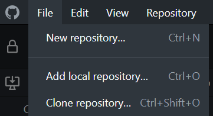
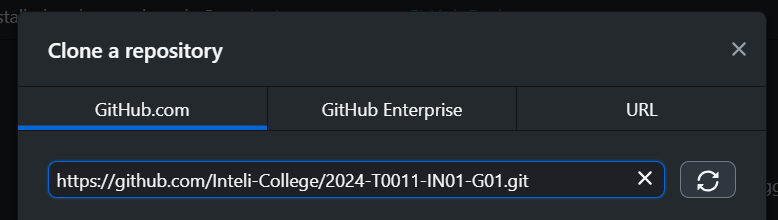
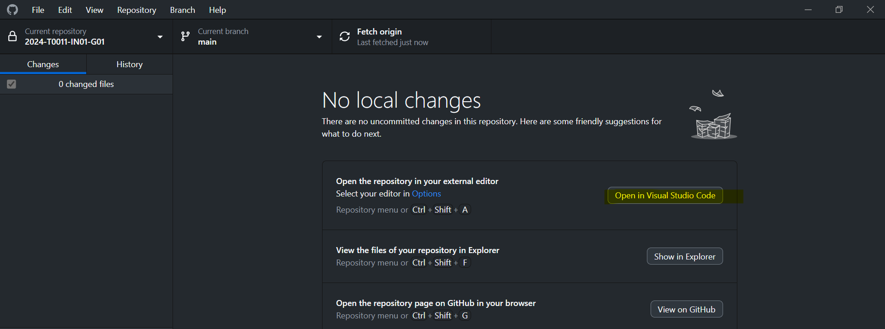
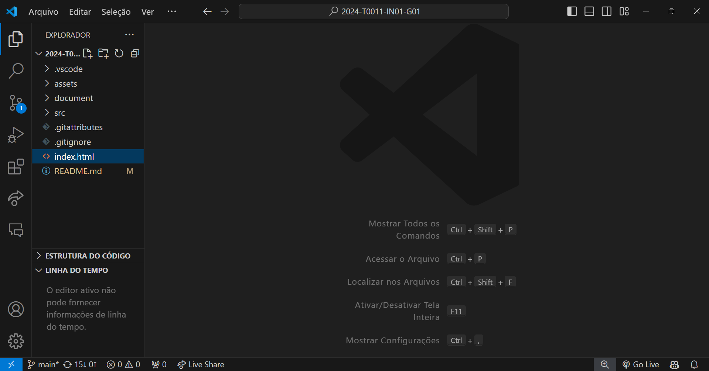

# Inteli - Instituto de Tecnologia e Liderança 

 

# The Knowledge Elevator
## The Building
## 👨‍🎓 Integrantes: 
- <a href="https://www.linkedin.com/in/caio-de-alcantara-santos-a020921b4/">Caio de Alcantara Santos</a>
- <a href="https://www.linkedin.com/in/cec%C3%ADlia-galv%C3%A3o/">Cecília Beatriz Melo Galvão</a>
- <a href="https://www.linkedin.com/in/giacomo-zema-matizonkas-7ab9072b2/">Giacomo Zema Matizonkas</a> 
- <a href="https://www.linkedin.com/in/ian-pereira-simao/">Ian Pereira Simão</a> 
- <a href="https://www.linkedin.com/in/kethlen-martins-040332221/">Kethlen Martins da Silva</a>
- <a href="https://www.linkedin.com/in/nataly-cunha">Nataly de Souza Cunha</a> 
- <a href="https://www.linkedin.com/in/vinicius-maciel-flor-8ab5b62b2/">Vinicius Maciel Flor</a>

## 👩‍🏫 Professores:
### Orientador(a) 
- <a href="https://www.linkedin.com/in/juliastateri/">Julia Stateri</a>
### Instrutores
- <a href="https://www.linkedin.com/in/andre-godoi-chiovato-83730228/">André Godoi</a>
- <a href="https://www.linkedin.com/in/bruna-mayer-00a556174/">Bruna Mayer</a> 
- <a href="https://www.linkedin.com/in/diogo-martins-gon%C3%A7alves-de-morais-96404732/">Diogo Martins Gonçalves de Morais</a> 
- <a href="https://www.linkedin.com/in/henrique-mohallem-paiva-6854b460/">Henrique Mohallem Paiva </a>
- <a href="https://www.linkedin.com/in/kizzyterra/">Kizzy Terra</a> 
- <a href="https://www.linkedin.com/in/renato-penha/">Renato Penha</a>

## 📜 Descrição

&nbsp;&nbsp;&nbsp;&nbsp;A *Oracle Academy* nasceu como uma iniciativa filantrópica através da criação de um programa educacional gratuito. Desse modo, a plataforma oferece recursos para que professores possam aprimorar suas habilidades e promover a educação. Todavia, observa-se que boa parte desses profissionais possui dificuldades em compreender a abrangência dos recursos disponíveis, o que se reflete na baixa do engajamento desses usuários. 
&nbsp;&nbsp;&nbsp;&nbsp;Assim, para a resolução do impasse, dados foram coletados provenientes de documentos, como o Termo de Abertura de Projeto do Inteli (TAPI), o Guia de Estilo de Marca e diversos manuais de utilização da plataforma. Ademais, informações foram tiradas do próprio site da *Oracle Academy* e de rodas de conversação com representantes legais da organização, ocorrendo, consequentemente, a dissolução de questões. 
&nbsp;&nbsp;&nbsp;&nbsp;Á vista disso, com a utilização dos dados, a solução desenvolvida consiste em uma gamificação da jornada de cadastro e onboarding da *Oracle Academy*, voltado para sistemas *web*, na qual professores possam conhecer todos os produtos e serviços disponibilizados na plataforma de forma intuitiva e atraente, a fim de aprimorar a percepção de valor da plataforma e o engajamento de potenciais clientes. 
&nbsp;&nbsp;&nbsp;&nbsp;Dessa forma, o *"serious game"* deverá ser utilizado como uma ferramenta para atrair a atenção e o interesse dos professores na plataforma da *Oracle Academy*, atuando de modo a facilitar a integração do docente com a plataforma, por meio de pequenas fases compostas por seções de aprendizado e seções de teste de conhecimento que irão simular a experiência real do usuário, considerando a sua grande gama de recursos. 
&nbsp;&nbsp;&nbsp;&nbsp;Isso posto, o objetivo do solução apresentada é que ocorra o aumento no engajamento e satisfação dos professores em relação ao programa da *Oracle Academy*, contribuindo para a utilização efetiva das ferramentas da plataforma e para a chegada da mesma em outras instituições de ensino e docentes.  
&nbsp;&nbsp;&nbsp;&nbsp;Logo, o critério de sucesso será feito através do controle de utilização dos usuários, ou seja, a medida que será utilizada para avaliação será o engajamento dos professores em relação ao game criado e, por conseguinte, à plataforma da *Oracle Academy*.

<a href="https://inteli-college.github.io/2024-T0011-IN01-G01/">Link do jogo</a>

## 📁 Estrutura de pastas

Dentre os arquivos e pastas presentes na raiz do projeto, definem-se:

- <b>assets</b>: aqui estão os arquivos relacionados a elementos não-estruturados deste repositório, como imagens.

- <b>document</b>: aqui está localizada a documentação do projeto, o Game Development Document (GDD).

- <b>src</b>: todo o código fonte criado para o desenvolvimento do projeto do jogo, estruturado em diferentes cenas.

- <b>index.html</b>: arquivo HTML pelo qual o Phaser e todas as cenas são referenciados. É a partir deste arquivo que se executa o jogo.

- <b>README.md</b>: arquivo guia que contem a explicação geral sobre o projeto e o jogo.

## 🔧 Como executar o código

1. *GitHub*

&nbsp;&nbsp;&nbsp;&nbsp;O *GitHub* é uma plataforma online de hospedagem e gerenciamento de projetos em forma de repositórios, possibilitando o versionamento de código e o desenvolvimento colaborativo. Tal recurso está disponível em forma de *site* e *software*, fornecendo uma utilização completa e otimizada para *desktop*. 

- **Clonando o repositório no *GitHub Desktop*:**

&nbsp;&nbsp;&nbsp;&nbsp;Através do <a href="https://desktop.github.com/">link</a>, deve-se baixar a versão mais adequada e atualizada do *GitHub Desktop*, disponível para os sistemas operacionais *Windows* e *macOS*.  Feito isso, deve-se executar o arquivo do programa e finalizar a instalação. 

&nbsp;&nbsp;&nbsp;&nbsp;Dentro do *GitHub Desktop*, após realizar o login ou o cadastro da conta GitHub, tem-se acesso à página inicial. Clicando em *File* (Arquivo) nas opções do canto superior esquerdo (Figura 1) e em "Clone new repository" (Clonar novo depositório), deve-se inserir o <a href="https://github.com/Inteli-College/2024-T0011-IN01-G01.git">link do repositório</a> do *The Knowledge Elevator* (Figura 2), dando prosseguimento com a clonagem dos arquivos do jogo. Dessa forma, é possível iniciar a utilização do código-fonte 

    Figura 1 - Passos para a clonagem de repositório  
    
   
   Fonte: Material produzido pelos autores (2024)
   

    Figura 2 - Passos para a clonagem de repositório  
    
   
   Fonte: Material produzido pelos autores (2024)
   

2. *Visual Studio Code*:

O *Visual Studio Code*, construído pela Microsoft, é um ambiente de desenvolvimento integrado (IDE) com uma ampla gama de recursos para a produção de software, incluindo realce de sintaxe para melhor visualização dos componentes do código, feedback de erros e alterações, controle de versões, entre vários outros benefícios, além de integrar uma biblioteca de extensões que ampliam sua funcionalidade, trazem otimização e perosnalização para o desenvolvimento.  

- **Editando o código**

Dentro do GitHub Desktop, após a clonagem do repositório, é possível visualizar algumas funcionalidades (Figura 3). Clicando no botão *"Open With Visual Studio Code"* (Abrir com o Visual Studio Code) a pasta do jogo é aberta dentro do *Visual Studio Code*, podendo-se ter acesso a seus arquivos e códigos (Figura 4).

    Figura 3 - Funcionalidades do repositório  
    
   
   Fonte: Material produzido pelos autores (2024)
   

    Figura 4 - Pasta do jogo no *Visual Studio Code*  
    
   
   Fonte: Material produzido pelos autores (2024)
   

3. *Node.js*:

&nbsp;&nbsp;&nbsp;&nbsp;O Node.js é um recurso que permite a execução de JavaScript fora do navegador, diretamente na máquina local. No contexto do desenvolvimento de jogos, o Node.js é frequentemente usado para configurar e gerenciar o ambiente de desenvolvimento, bem como para executar scripts de automação e servidores de aplicativos. Ele é essencial para muitas ferramentas e frameworks populares de desenvolvimento de jogos baseados na web, como o Phaser.js, biblioteca utilizada para o desenvolvimento deste jogo.

&nbsp;&nbsp;&nbsp;&nbsp;Para a instalação do *Node.js*, deve-se visitar a sua <a href="https://nodejs.org/en/download">página de *download*</a> e baixar a versão correspondente à máquina em questão, disponível para os sistemas operacionais *Windows* e *macOS*. Com isso, deve-se abrir o arquivo executável e seguir as instruções internas.

4. *Live Server*

&nbsp;&nbsp;&nbsp;&nbsp;*Live Server* é uma extensão interna do *Visual Studio Code* que permite a utilização do próprio computador como um servidor local para desenvolvimento *web*, atualizando o navegador em tempo real quando alterações no código são feitas. Tal recurso facilita a programação e o teste de páginas da *web*.

&nbsp;&nbsp;&nbsp;&nbsp;Para instalar a extensão, deve-se clicar na aba de extensões do Visual Studio Code, indicada na Figura X. Ao digitar *"Live Server"* no campo de pesquisa, clicar no resultado e em *"Install"* (Instalar), será possível integrar a funcionalidade ao IDE.

- **Executando o jogo com *Live Server* e HTML**

&nbsp;&nbsp;&nbsp;&nbsp;Por fim, para executar o jogo, deve-se clicar com o botão direito no arquivo *index.html* (Figura 3) e buscar a opção *"Open with Live Server"* (Abrir com o Live Server) no topo da lista. Fazendo isso, o jogo será executado em uma aba do navegador padrão do sistema.

    Figura 3 - Opções de index.html  
    
   
   Fonte: Material produzido pelos autores (2024)
   

<h3>Versões utilizadas</h3>

&nbsp;&nbsp;&nbsp;&nbsp;Na Tabela 1, estão expostas as versões de cada software utilizado para o desenvolvimento e execução do *The Knowledge Elevator*.

   
   Tabela 1 - Versões dos softwares para execução do jogo 
Recurso | Versão  
--- | ---
GitHub Desktop | 3.3.12 (x64)
Visual Studio Code | 1.87.2 (user setup)
Node.js | 18.17.1
Live Server | v5.7.9
 

Fonte: Material produzido pelos autores (2024)

## 🗃 Histórico de lançamentos

* 0.5.0 - 11/04/2024 - Refinamento da programação e *design* em todas as fases, havendo a refatoração dos códigos, resolução de erros, início de implemententações de acessibilidade e de idioma.
    
* 0.4.0 - 28/03/2024 - Término do *puzzle* da Picotadora na fase 2 (Cursos) que leva para o elevador com o tótem interativo, no qual há a explicação das etapas de inscrição de Canais e, posteriormente, a presença de outro *puzzle*.
    
* 0.3.0 - 15/03/2024 - Conexão da fase 1 (Cadastro) com a fase 2 (Cursos), havendo a programação do corredor, das ações executadas a partir do clique em cada porta e maçaneta, bem como a validação de que, caso todas as portas sejam clicadas, o jogador é liberado para a resolução do *puzzle* da Picotadora.
    
* 0.2.0 - 01/03/2024 - Conexão da tela inicial através da animação da porta do prédio, que leva para a fase 1 (Cadastro), passando-se em uma recepção que contempla todas as etapas de cadastro na conta *Oracle* e conta *Oracle Academy*.
    
* 0.1.0 - 16/02/2024 - Programação inicial e lançamento da tela de apresentação do jogo, contendo elementos visuais elaborados pela equipe e animações para cativar o jogador.

## 📋 Licença/License

<a property="dct:title" rel="cc:attributionURL" href="https://github.com/Inteli-College/2024-T0011-IN01-G01">THE BUILDING</a> by <a rel="cc:attributionURL dct:creator" property="cc:attributionName" href="https://www.inteli.edu.br/">INTELI</a>, <a rel="cc:attributionURL dct:creator" property="cc:attributionName" href="https://github.com/caio-alcantara">Caio de Alcantara Santos</a>, <a rel="cc:attributionURL dct:creator" property="cc:attributionName" href="https://github.com/ceciliagalvaoo">Cecília Beatriz Melo Galvão</a>,  <a rel="cc:attributionURL dct:creator" property="cc:attributionName" href="https://github.com/Zema02">Giacomo Zema Matizonkas</a>, <a rel="cc:attributionURL dct:creator" property="cc:attributionName" href="https://github.com/ianpsa">Ian Pereira Simão</a>, <a rel="cc:attributionURL dct:creator" property="cc:attributionName" href="https://github.com/kethlenmartins">Kethlen Martins da Silva</a>, <a rel="cc:attributionURL dct:creator" property="cc:attributionName" href="https://github.com/nataly-cunha-inteli">Nataly de Souza Cunha</a>, <a rel="cc:attributionURL dct:creator" property="cc:attributionName" href="https://github.com/viniciusmflor">Vinicius Maciel Flor</a> is licensed under 
<a href="http://creativecommons.org/licenses/by/4.0/?ref=chooser-v1" target="_blank" rel="license noopener noreferrer" style="display:inline-block;">Attribution 4.0 International</a>.

