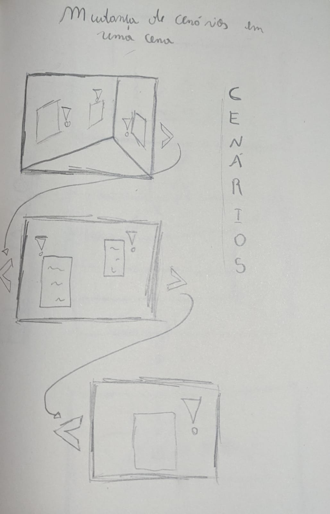

# GDD - Game Design Document - Módulo 1 - Inteli

## The Knowledge Elevator
### The Building

#### Nomes dos integrantes do grupo
- <a href="https://www.linkedin.com/in/caio-de-alcantara-santos-a020921b4/">Caio de Alcantara Santos</a>
- <a href="https://www.linkedin.com/in/cec%C3%ADlia-galv%C3%A3o/">Cecília Beatriz Melo Galvão</a>
- <a href="https://www.linkedin.com/in/giacomo-zema-matizonkas-7ab9072b2/">Giacomo Zema Matizonkas</a> 
- <a href="https://www.linkedin.com/in/ian-pereira-simao/">Ian Pereira Simão</a> 
- <a href="https://www.linkedin.com/in/kethlen-martins-040332221/">Kethlen Martins da Silva</a>
- <a href="https://www.linkedin.com/in/nataly-cunha">Nataly de Souza Cunha</a> 
- <a href="https://www.linkedin.com/in/vinicius-maciel-flor-8ab5b62b2/">Vinicius Maciel Flor</a>

## Sumário

[1. Introdução](#c1)

[2. Visão Geral do Jogo](#c2)

[3. Game Design](#c3)

[4. Desenvolvimento do jogo](#c4)

[5. Casos de Teste](#c5)

[6. Conclusões e trabalhos futuros](#c6)

[7. Referências](#c7)

[Anexos](#c8)

<br>


# <a name="c1"></a>1. Introdução

## 1.1. Escopo do Projeto

### 1.1.1. Contexto da indústria

&nbsp;&nbsp;&nbsp;&nbsp;A *Oracle Academy* é uma iniciativa filantrópica que fornece **educação gratuita na área de tecnologia** para alunos e instituições por todo o globo, inovando no setor educacional ao fornecer tecnologia e currículo avançados para que qualquer aluno do mundo inteiro consiga se capacitar na área. Cursos, *workshops* e materiais de apoio são disponibilizados aos professores, que podem repassar este conteúdo para seus alunos. A *Oracle Academy* está inserida em um mercado de educação dinâmico, em constante evolução e com fortes concorrentes, como a *Microsoft Imagine Academy*, a *IBM Skills* e a *AWS Academy*. <br>
&nbsp;&nbsp;&nbsp;&nbsp; Sendo uma iniciativa filantrópica, a *Oracle Academy* não possui objetivo principal de gerar lucro. Entretanto, a plataforma pode gerar outros tipos de retorno positivo por meio do recrutamento de talentos, tendo em vista que através da plataforma formam-se profissionais capacitados, dessa maneira, o retorno dá-se através do aumento da disponibilidade de mão de obra no mercado da *Oracle*, também há certo retorno a partir do marketing e apresentação da *Oracle* para novos estudantes de tecnologias, e por meio da criação de parcerias, tais como a parceria com o Inteli - Instituto de Tecnologia e Liderança. <br>
&nbsp;&nbsp;&nbsp;&nbsp;Em suma, a *Oracle Academy* é uma das principais *players* quando se trata de programas online educativos em tecnologia, de forma totalmente gratuita. A marca abrange um mercado verdadeiramente global, presente em diversos países, e consegue realizar parcerias com instituições e organizações do mundo inteiro. <br>

### 1.1.2. Análise das 5 Forças de Porter
&nbsp;&nbsp;&nbsp;&nbsp; Segundo Magretta (2019), as 5 Forças de Porter, modelo definido por Michael Porter, têm a função de analisar e identificar vários aspectos de competitividade dentro de determinado mercado, olhando para as forças que moldam a intensidade da concorrência e, consequentemente, o potencial de lucro, fazendo isso por meio da análise de 5 fatores que moldam a competitividade de uma indústria:
1. Poder de negociação dos clientes: Identifica se os clientes possuem, por exemplo, diversas empresas para escolher onde comprar e podem influenciar diretamente o preço de um produto. Caso possuam muitas opções, seu poder de barganha é alto e o cliente pode exigir preços menores, diminuindo a lucratividade de uma empresa.
2. Poder de negociação dos fornecedores: Caso uma empresa trabalhe num ramo em que a matéria-prima ou insumos sejam raros, os fornecedores de tais materiais decidem quanto vão cobrar pelo serviço, ou seja, detém um poder de negociação maior em relação ao negócio.
3. Ameaça de produtos ou serviços substitutos: Este ponto identifica quais serviços atuais podem substituir aquele que é oferecido pela empresa, bem como quais potenciais produtos podem ser criados e que acabam substituindo aquilo ofertado pelo negócio. 
4. Ameaça de novos entrantes: Analisa o setor de mercado de tal empresa e determina o quão difícil é para que uma nova empresa surja no ramo.
5. Rivalidade entre concorrentes existentes: Identifica os concorrentes de tal empresa em um setor e determina se esta concorrência é alta ou baixa. Apesar de a concorrência alta ser algo benéfico para os clientes, é algo ruim para as empresas, porque força elas a inovarem e diminuírem os preços, diminuindo a lucratividade. 
<div align="center">
   
  <sub>Figura X - Análise das 5 Forças de Porter da Oracle Academy</sub>  
  
    
   
   <sup>Fonte: Material produzido pelos autores (2024)</sup>
   
</div>

&nbsp;&nbsp;&nbsp;&nbsp; Fazendo uma análise das 5 Forças de Porter da Oracle Academy e do seu setor, percebemos os seguintes pontos:
* Os principais clientes do setor são professores de ensino médio/superior e alunos. Apesar de poder escolher entre várias plataformas de ensino de tecnologia disponíveis, os clientes de um setor como o da Oracle Academy não possuem tanto poder de negociação, uma vez que o serviço já é gratuito e o cliente não consegue influenciar nisso, podendo apenas interferir brevemente em como o produto é fornecido. 
* Quanto aos fornecedores deste setor, entendemos que eles são os que produzem os materiais de ensino que as plataformas utilizam, como cursos, workshops, palestras e materiais de aula. Dessa forma, o poder de negociação dos fornecedores é mediano, uma vez que as empresas podem tranquilamente mudar o responsável por quem produz esses conteúdos, apesar de poder enfrentar problemas ao reestruturar isso nas plataformas.
* Em relação à ameaça de produtos substitutos, entendemos que essa é uma preocupação que deve ser considerada de nível alto, uma vez que existem diversas outras plataformas de educação com foco em tecnologia que ainda não estão exatamente no mesmo mercado que a Oracle Academy, mas podem suprir essa demanda (exemplos incluem Alura e Udemy), inclusive na área de fornecimento de cursos sobre as tecnologias da Oracle. Esses novos produtos substitutos, como os já citados anteriormente, podem causar grande impacto no setor, uma vez que eles possuem uma metodologia de ensino diferenciada e mais "atual" do que as empresas já presentes nesse setor. Dessa forma, esses novos produtos podem apelar, por exemplo, para a clientela mais jovem e captar esses consumidores das empresas já existentes.
* A ameaça de novos entrantes no setor da Oracle Academy é baixa, já que é necessária uma quantidade grande de recursos para se estabelecer e isso se mostra verdadeiro uma vez que boa parte das empresas do setor só passaram a surgir porque estavam amparadas sob empresas gigantes da área de tecnologia, como Oracle, Amazon, IBM e Google. Ou seja, uma nova empresa, principalmente sem o amparo de alguma *Big Tech* teria grande dificuldade em se acertar no mercado. O impacto de um novo entrante no setor, a depender de como ele opera, pode ser alto, uma vez que ele pode roubar não só os consumidores em potencial mas também os que já são clientes das empresas. 
* A rivalidade entre os concorrentes existentes é um fator de grande preocupação neste mercado. O setor é composto por  gigantes da tecnologia com soluções e plataformas semelhantes sendo oferecidas também de maneira gratuita, ou seja, a concorrência que existe entre *Big Techs* se reflete nos programas filantrópicos educacionais de cada empresa.


### 1.1.3. Análise SWOT
&nbsp;&nbsp;&nbsp;&nbsp;A Análise SWOT (Figura 1) é uma ferramenta que busca realizar um planejamento estratégico pelo qual empresas podem identificar quais são as suas forças, fraquezas, oportunidades e ameaças diante do mercado, buscando entender os diversos aspectos internos (que podem ser controlados) e aspectos externos (que independem da empresa) que podem impactar o negócio (Hofrichter, 2017).
<br> <br>

<div align="center">
   
   <sub>Figura 2 - Análise SWOT da Oracle Academy</sub>
   
    
   
   <sup>Fonte: Material produzido pelos autores (2024)</sup>
   
</div>

&nbsp;&nbsp;&nbsp;&nbsp;A Análise SWOT é uma ferramenta que busca realizar um planejamento estratégico pelo qual empresas podem identificar quais são as suas forças, fraquezas, oportunidades e ameaças diante do mercado, buscando entender os diversos aspectos internos (que podem ser controlados) e aspectos externos (que independem da empresa) que podem impactar o negócio (Hofrichter, 2017).\
&nbsp;&nbsp;&nbsp;&nbsp;Ao realizar a Análise SWOT da *Oracle Academy*, percebemos diversos pontos que devem ser levados em consideração, iniciando, em especial, pelas forças, um exemplo disso são as certificações oferecidas pela *Oracle Academy*, documentos que são reconhecidos no mundo todo, possuindo um grande peso, uma vez que são emitidos por uma das maiores empresas de tecnologia do mundo.\
&nbsp;&nbsp;&nbsp;&nbsp;Contudo, não são só as certificações que contribuem para as forças, pois a plataforma possui também um currículo que foca em tecnologias atuais, evitando o estudo de assuntos defasados, além do seu acordo com o Ministério da Educação, que certamente não só facilita mas também alavanca a disseminação da plataforma no Brasil.\
&nbsp;&nbsp;&nbsp;&nbsp;Todavia, tendo em mente agora as fraquezas da plataforma, a Oracle Academy apresenta alguns empecilhos, como a dificuldade em manter os usuários engajados e fazer com que eles utilizem todos os recursos disponíveis, além do fato de que os materiais de estudo estão presentes apenas em inglês, sendo um grande dificultador para aqueles que desejam aprender tecnologia mas não falam o idioma. Para mais, ainda existe o fato de que os aspectos visuais da plataforma, se comparados com as plataformas de grandes concorrentes, como Amazon, Microsoft e IBM não se destacam, contribuindo para a migração dos consumidores para outras plataformas.\
&nbsp;&nbsp;&nbsp;&nbsp;Entretanto, para contornar esse contexto de fraquezas, a plataforma atualmente é rodeada de muitas oportunidades, como a demanda por educação online e o estudo por tecnologia, que vêm crescendo muito desde a pandemia de Covid-19, além das grandes oportunidades de se realizarem parcerias com diversas instituições de ensino, a fim de que a plataforma seja usada diretamente nas escolas parceiras.\
&nbsp;&nbsp;&nbsp;&nbsp;Em contrapartida, as oportunidades não impedem as ameaças de atingirem a plataforma, como a falta de tecnologia nas escolas, principalmente aquelas do setor público, o que pode impedir ou dificultar que a *Oracle Academy* adentre nesses ambientes, uma vez que a plataforma necessita de infraestruturas básicas, como acesso à internet, que nem sempre estão disponíveis nessas escolas.\
&nbsp;&nbsp;&nbsp;&nbsp;Ademais, também ocorre a influência da existência dos fortes concorrentes no mercado, tais como a Microsoft Imagine Academy e a IBM Skills Academy, organizações capazes de representar ameaças pois são encaradas como competidores diretos de mercado.\
&nbsp;&nbsp;&nbsp;&nbsp;Logo, são muitos os pontos que podem ser analisados e estruturados, tendo em vista o estudo aprofundado da *Oracle Academy* pelo método de análise SWOT, o que ajuda a mesma a fomentar o seu desempenho e desenvolvimento como uma ferramenta educacional, responsável pela capacitação dos cidadãos.
   

### 1.1.4. Descrição da Solução Desenvolvida

&nbsp;&nbsp;&nbsp;&nbsp;A *Oracle Academy* nasceu como uma iniciativa filantrópica através da criação de um programa educacional gratuito. Desse modo, a plataforma oferece recursos para que professores possam aprimorar suas habilidades e promover a educação. Todavia, observa-se que boa parte desses profissionais possui dificuldades em compreender a abrangência dos recursos disponíveis, o que se reflete na baixa do engajamento desses usuários.<br>
&nbsp;&nbsp;&nbsp;&nbsp;Assim, para a resolução do impasse, dados foram coletados provenientes de documentos, como o Termo de Abertura de Projeto do Inteli (TAPI), o Guia de Estilo de Marca e diversos manuais de utilização da plataforma. Ademais, informações foram tiradas do próprio site da Oracle Academy e de rodas de conversação com representantes legais da organização, ocorrendo, consequentemente, a dissolução de questões.<br>
&nbsp;&nbsp;&nbsp;&nbsp;Á vista disso, com a utilização dos dados, a solução desenvolvida consiste em uma gamificação da jornada de cadastro e onboarding da *Oracle Academy*, voltado para sistemas *web*, na qual professores possam conhecer todos os produtos e serviços disponibilizados na plataforma de forma intuitiva e atraente, a fim de aprimorar a percepção de valor da plataforma e o engajamento de potenciais clientes.<br>
&nbsp;&nbsp;&nbsp;&nbsp;Dessa forma, o *"serious game"* deverá ser utilizado como uma ferramenta para atrair a atenção e o interesse dos professores na plataforma da *Oracle Academy*, atuando de modo a facilitar a integração do docente com a plataforma, por meio de pequenas fases compostas por seções de aprendizado e seções de teste de conhecimento que irão simular a experiência real do usuário, considerando a sua grande gama de recursos.<br>
&nbsp;&nbsp;&nbsp;&nbsp;Isso posto, o objetivo do solução apresentada é que ocorra o aumento no engajamento e satisfação dos professores em relação ao programa da *Oracle Academy*, contribuindo para a utilização efetiva das ferramentas da plataforma e para a chegada da mesma em outras instituições de ensino e docentes. <br>
&nbsp;&nbsp;&nbsp;&nbsp;Logo, o critério de sucesso será feito através do controle de utilização dos usuários, ou seja, a medida que será utilizada para avaliação será o engajamento dos professores em relação ao game criado e, por conseguinte, à plataforma da Oracle Academy.


### 1.1.5. Proposta de Valor

&nbsp;&nbsp;&nbsp;&nbsp;O Value Proposition Canvas (Canvas de Proposta de Valor) consiste em um modelo visual de análise utilizado para ajudar empresas a compreenderem melhor as atividades, necessidades e desejos de seus clientes, assim como para desenvolver propostas de valor que atendam diretamente a essas demandas de forma eficaz (Osterwalder, 2015). 

<div align="center">
   
   <sub>Figura 3 - Canva Proposta de Valor do Projeto</sub>
   
    
   
   <sup>Fonte: Material produzido pelos autores (2024)</sup>
   
</div>

&nbsp;&nbsp;&nbsp;&nbsp;Analisando o VPC da Oracle Academy, identificamos:
1. O cliente
   * Clientes: os clientes da plataforma são professores, e, diariamente, realizam tarefas de passar conteúdos específicos da área de tecnologia para seus alunos, bem como a facilitação do acesso a esses conteúdos
   * Durante o dia-a-dia do professor, ele lida com dores ao tentar encontrar, de maneira fácil e organizada, conteúdos e cursos da área de tecnologia para ofertar aos alunos, principalmente levando em conta que esses conteúdos devem ser fornecidos por fontes certificadas. 
   * É de interesse do professor encontrar todos esses conteúdos de maneira organizada e em apenas um local e também disponibilizar tudo isso para os seus alunos de maneira simples

2. A solução:
   * A plataforma Oracle Academy tem como objetivo fornecer todos esses cursos em um só lugar, permitindo também a integração de alunos à plataforma, de modo que eles consigam acessar o conteúdo diretamente da fonte. 
   * Os conteúdos e cursos passados na Oracle Academy contam com uma certificação dada pela Oracle, uma das maiores empresas de tecnologia do mundo.
   * Por meio da plataforma, os professores conseguem economizar tempo na busca e disponibilização de materiais aos alunos, certificando-se também de que está passando um material de qualidade e produzido por uma autoridade na área, a Oracle em si. 


### 1.1.6. Matriz de Riscos

&nbsp;&nbsp;&nbsp;&nbsp; Segundo Tomaz; Gagliasso; Malavota (2020), define-se como Matriz de risco a ferramenta de gestão responsável  por identificar os riscos que podem afetar negativamente ou positivamente um projeto. Essa matriz é construída através da análise da probabilidade de algo acontecer e do impacto caso esse algo aconteça. Exatamente para esta relação entre probabilidade e impacto é dado o nome de "risco".

<div align="center">
   
   <sub>Figura 4 - Matriz de Risco do Projeto </sub>

    
   
   <sup>Fonte: Adaptado de <a href="https://certificacaoiso.com.br/matriz-de-riscos-o-que-e-e-como-aplicar/">Templum</a> (2024)</sup>
   
</div>

&nbsp;&nbsp;&nbsp;&nbsp; Ainda de acordo com os autores, a matriz de risco deve ser encarada como um processo iterativo, ou seja, deve ser sempre revisitada e atualizada durante a fase de desenvolvimento do projeto. Isso deve ser feito porque riscos podem ganhar ou perder importância, e, caso não sejam revisitados, a equipe pode perder a noção de novos riscos que podem causar grande impacto no projeto ou aplicar muito esforço para conter riscos que, na fase atual, não demonstram ameaça. Dessa maneira, após 6 semanas de trabalho, a matriz de risco do projeto se encontra de tal maneira:
1. Alguns riscos atualizados:
* Design fora da Redwood: este foi um risco que, no início do projeto, foi considerado em probabilidade improvável e impacto alto. Hoje em dia, consideramos que a probabilidade de isso acontecer é praticamente nula, uma vez que grande parte dos elementos visuais do jogo já foram desenvolvidos e aprovados pelo parceiro de projeto.
   * Para evitarmos esta ameaça, o design do nosso jogo foi baseado quase que inteiramente nas *brand guidelines* da Oracle Academy. 
* Baixa otimização: Possuir um jogo pouco otimizado e que rodasse de maneira não-fluida era considerado um risco moderado no começo do projeto. Hoje, entendemos que, mesmo com a adição de muitas cenas e assets, o jogo ainda rodará com tranquilidade em qualquer navegador, resultando em um risco de probabilidade baixa.
   * Para esta ameaça, otimizamos o tamanho dos assets, bem como a eliminação de assets não utilizados.
* Acesso a plataforma negado: Nas primeiras semanas do projeto, consideramos a possibilidade de não conseguirmos utilizar a plataforma da Oracle Academy para embasar o nosso jogo como um risco de probabilidade alta e impacto significativo. 
   * Atualmente, percebe-se que este risco se concretizou em partes. Apesar de não termos conseguido acesso direto à plataforma, foi possível visualizar como o sistema funciona por meio de vídeos gravados por professores. 
2. Riscos adicionados:
* Falta de tempo para entregar as demandas: Atualmente, possuímos apenas a sprint 4 para adicionar novos conteúdos no jogo. Por conta disso, existe um risco em não conseguirmos adicionar tudo aquilo que queremos (3 fases finalizadas) ao final da quarta sprint. A preocupação por este risco é embasada pelos acontecimentos das sprints anteriores, onde não conseguimos finalizar 100% cada fase que nos propusemos a fazer, sempre faltando algo para a próxima sprint.
   * Plano de resposta: Como o jogo já possui conteúdo suficiente para ser entregue, podemos lidar com essa ameaça por meio da retirada da prioridade da adição de novos conteúdos, e aumentar a prioridade da revisão de conteúdos já existentes no jogo.
* Entregas insuficientes: Existe uma preocupação em que a quantidade de fases que pretendemos entregar ao final do projeto não seja satisfatória para o parceiro. Desse modo, classificamos este risco como de baixa probabilidade porque já possuímos 2 fases completamente prontas, um número que já é superior à média de fases entregues normalmente. 
   * Assim como a ameaça acima, o plano de resposta consiste em priorizar aspectos que sejam mais relevantes para o jogo.
* Documentação desatualizada: Conforme o projeto avança, entendemos que uma documentação desatualizada causa grande impacto, uma vez que esta é responsável por fornecer todo o tipo de informação acerca do que estamos desenvolvendo. Ademais, estamos trabalhando ativamente para manter este documento sempre com as atualizações mais recentes. Por isso, classificamos a probabilidade desse risco como baixa.
   * Um plano de resposta para essa ameaça é direcionar mais membros do grupo para trabalhar no GDD na medida em que estes membros fiquem livres de suas tasks de design e programação.
* Bugs e dificuldade em escalar o projeto: Com o crescimento do projeto, cada vez mais pastas, arquivos de códigos e assets são adicionados. Por conta disso, a probabilidade de encontrarmos bugs ainda não testados e resolvidos no jogo cresce, bem como a dificuldade de tornar o jogo escalável, ou seja, fácil de desenvolver novas fases. 
   * Lidar com esta ameaça requer apoio técnico de professores e orientadores a fim de entender melhor como podemos solucionar bugs e problemas.
* Qualidade de software: Com o avanço do projeto, é uma preocupação que a qualidade do código escrito acabe diminuindo apesar de o jogo funcionar normalmente na prática. Como estamos aprendendo melhores práticas de programação apenas na reta final do projeto, existe uma possibilidade média de não conseguirmos implementar todas essas práticas no código do jogo. O impacto deste risco é considerado médio porque ele não afeta diretamente o funcionamento do jogo, mas sim a legibilidade e escalabilidade do projeto. 
   * Assim como a ameaça anterior, o plano de ação consiste em recorrer aos professores e orientadores a fim de entender o que exatamente pode ser melhorado no jogo em termos de qualidade de software.

&nbsp;&nbsp;&nbsp;&nbsp;Em junção com a matriz de riscos, também foi elaborada uma matriz de **oportunidades**:
<div align="center">
   
   <sub>Figura 5 - Matriz de Oportunidades</sub>

    
   
   <sup>Fonte: Material produzido pelos autores (2024)</sup>
   
</div>

&nbsp;&nbsp;&nbsp;&nbsp;Na matriz, destacamos três oportunidades principais:
* A utilização do material visual já fornecido pela Oracle Academy para criar uma interface gráfica que se alinhe com os parâmetros da marca.
* A utilização de puzzles e minigames para a criação de níveis/fases que, ao mesmo tempo que ensinam sobre um conteúdo, mantêm o jogador engajado.
* A utilização de sons e músicas que fossem de agrado ao grupo e também que fossem livres de *copyright*, algo que, mesmo não trazendo impacto tão significativo ao jogo, colabora para a sua *Aesthetic*. 


## 1.2. Requisitos do Projeto 
&nbsp;&nbsp;&nbsp;&nbsp;Durante a fase inicial do projeto, foi feito um encontro para tirar dúvidas com o parceiro. Neste encontro, foram definidos como vários aspectos do jogo deveriam ser, tais como gênero, algumas mecânicas e até mesmo o dispositivo onde o *game* rodaria. Com essa mentoria do parceiro de projeto, definimos os seguintes requisitos para o nosso jogo:

<div align="center">
   
   <sub>Tabela 1 - Requisitos do Projeto</sub><br>
\# | Requisito  
--- | ---
1 | O jogo precisa ser um "serious game", sem elementos risíveis
2 | A jogabilidade deve ser em primeira pessoa, com o professor atuando como protagonista da história
3 | Toda a arte do jogo deve ser baseada na identidade visual da Oracle Academy, incluindo ícones, desenhos e paleta de cores
4 | Devem haver pelo menos 5 fases no jogo: cadastro, conhecendo a plataforma, canais, cloud e sessão de suporte
5 | O jogo deve seguir uma estética minimalista e "low-profile", sem muitos detalhes que distraiam o jogador
6 | O jogador terá que realizar tarefas relacionadas ao assunto da fase para acumular pontos e, assim, passar de fase
7 | Ao final do jogo, o jogador poderá conquistar um "Badge" que certifica que ele concluiu o jogo 
8 | As tarefas que o jogador terá que realizar têm que ser engajadoras
9 | Os movimentos do jogo serão realizados com uma mecânica "point and click"
10 | A princípio, o jogo deverá ser desenvolvido apenas para Desktop<br>
</div>
<div align="center">
<sup>Fonte: Material produzido pelos autores (2024)</sup>
</div>


## 1.3. Público-alvo do Projeto

&nbsp;&nbsp;&nbsp;&nbsp;O público-alvo do jogo desenvolvido para abordar o problema de integração de novos professores membros do programa Oracle Academy é composto por professores que ingressam no programa e enfrentam dificuldades no processo de integração devido à sua rotina corrida.

&nbsp;&nbsp;&nbsp;&nbsp;Essa categoria de público se encontra numa faixa etária predominantemente adulta, tendo em média de 25 a 60 anos de idade. 

&nbsp;&nbsp;&nbsp;&nbsp;Quanto ao gênero, não há restrições, uma vez que existem professores de todos os gêneros que usam a plataforma. Da mesma maneira, a localização geográfica é muito abrangente, dado que a Oracle Academy é uma plataforma que atua no mundo todo.

&nbsp;&nbsp;&nbsp;&nbsp;Por fim, é necessário destacar que, por conta de suas rotinas corridas, os professores valorizam soluções que sejam tão eficientes como práticas, o que lhes permite integrar rapidamente as ferramentas e recursos disponíveis na plataforma em suas práticas acadêmicas.


# <a name="c2"></a>2. Visão Geral do Jogo
&nbsp;&nbsp;&nbsp;&nbsp;*The Knowledge Elevator* (O Elevador de Conhecimento) visa transformar o processo de *onboarding* de novos professores membros da *Oracle Academy* em uma imersão educativa e engajante, por meio de uma experiência gamificada em primeira pessoa que conduz o usuário pelos diferentes andares de um prédio da Oracle Academy, sendo cada andar projetado para familiarizá-lo sobre os benefícios e procedimentos da plataforma, tornando assertivo e envolvente esse processo de aprendizado. Através do jogo, espera-se atrair novos usuários interessados em aprimorar suas habilidades de integrar tecnologia educacional no ensino, bem como tornar a plataforma mais engajante e fácil de usar para essas pessoas.

## 2.1. Objetivos do Jogo

Requisitos de avanço de fase da Recepção/Cadastro:<br><br>

&nbsp;&nbsp;&nbsp;&nbsp;Requisitos de fase representam critérios essenciais que determinam o progresso dos jogadores em um determinado estágio ou nível de um jogo. Estes requisitos podem variar de acordo com a natureza e complexidade do jogo, mas geralmente envolvem a conclusão de tarefas específicas, a obtenção de determinadas pontuações ou a demonstração de habilidades necessárias para avançar. No contexto do desenvolvimento de jogos, entender e definir adequadamente os requisitos da fase é essencial para proporcionar uma experiência de jogo envolvente e desafiadora. Nesta seção, são explorados os detalhes os requisitos de avanço de fase do *The Knowledge Elevator*, destacando suas características e importância no contexto do jogo. <br> <br>

Tela inicial:
1. Após a espera da abertura do jogo e da aparição dos elementos visuais, o usuário deve clicar na tela para iniciar o jogo, indo para a primeira fase que

Recepção:
1. O usuário deve ler o primeiro balão de introdução sobre o jogo e, após lê-lo, deve clicar na tela para continuar.
2. O usuário deve ler o segundo balão de introdução sobre o jogo e, após lê-lo, deve clicar na tela para continuar.

Slides de Cadastro no Computador:
1. Após a introdução, quando o usuário passa o mouse sobre a mesa com o computador, ela se destaca, informando que é um elemento clicável. O usuário deve clicar na mesa e realizar a leitura dos slides de cadastro no computador. Esses slides contêm informações essenciais sobre o procedimento de cadastro.
Quiz:
2. Após a leitura dos slides, é apresentado um quiz composto por 5 perguntas. Essas perguntas são baseadas no conteúdo dos slides de cadastro.
3. Critério de Aprovação:
Para avançar para a próxima fase, o usuário deve acertar pelo menos 60% das perguntas do quiz.
4. Consequências da Performance no Quiz:
Se a pessoa acertar 60% ou mais das perguntas, ela é liberada para passar de fase e recebe uma insígnia especial.
Se a pessoa acertar menos de 60% das perguntas, ela não avança para a próxima fase imediatamente.
5. Reinício da Fase de Forma Simplificada:
Caso a pessoa não atenda ao critério de aprovação (acertar menos de 60% das perguntas), ela é convidada a refazer a fase de uma forma mais simplificada.
O reinício da fase simplificado pode envolver uma revisão do conteúdo dos slides de cadastro, uma explicação mais detalhada das informações ou um formato de quiz mais acessível.
6. Ao sair do quiz, o jogador volta para a cena de recepção e deve interagir com o elevador, que o leva para o primeiro andar (segunda fase).
7. Na segunda fase, o jogador irá aprender sobre os cursos disponíveis na Oracle Academy. O jogador se depara com 4 portas, e, ao clicar em cada uma delas, vê um texto explicativo sobre cada texto.
8. Após visitar todas as portas, o jogador pode avançar para o puzzle da segunda fase: uma picotadora de papel, onde o jogador terá que recolher o papel picotado e juntá-lo em uma ordem específica. Ao formar a imagem correta, o jogador é então levado novamente ao elevador, onde prosseguirá para a próxima fase.
9. Enquanto leva o jogador para a próxima fase, o elevador apresenta uma falha! Então, o jogador precisa consertar a máquina por meio da resolução de puzzles que o introduza ao assunto que será abordado (canais). Além disso, o jogador poderá interagir com um totem dentro do elevador, que o ensinará ainda mais sobre tal conteúdo.
## 2.2. Características do Jogo

### 2.2.1. Gênero do Jogo
&nbsp;&nbsp;&nbsp;&nbsp;Por preferência da parceira, o gênero escolhido foi um *serious game*, que se trata de um jogo projetado com o propósito principal de educar ou treinar os jogadores em áreas específicas, enquanto ainda mantém elementos divertidos e interativos do jogo. No contexto do projeto para o Oracle Academy, o "serious game" é escolhido como o formato ideal para abordar o problema do processo de onboarding e integração de novos professores.

### 2.2.2. Plataforma do Jogo

&nbsp;&nbsp;&nbsp;&nbsp;De acordo com as preferências da Oracle, o suporte escolhido para o jogo foi o navegador *web*, pois, ao se disponibilizar o jogo na *web*, os jogadores poderão acessá-lo de qualquer lugar e a qualquer momento, desde que possuam conexão com a internet. Isso oferece uma experiência de jogo mais acessível, permitindo que os jogadores participem do processo de onboarding do Oracle Academy no seu próprio ritmo e de acordo com sua própria agenda. Por conta das limitações técnicas em relação ao que é aprendido no módulo 1, por momento, o jogo poderá ser jogado apenas em plataformas Desktop..*

### 2.2.3. Número de jogadores

&nbsp;&nbsp;&nbsp;&nbsp;De acordo com as preferências da parceira, foi definido que haverá um só jogador, visando proporcionar uma experiência de usuário mais focada e individual de onboarding sobre a Oracle Academy.

### 2.2.4. Títulos semelhantes e inspirações

&nbsp;&nbsp;&nbsp;&nbsp;Como inspirações para o desenvolvimento do jogo, consideramos o estilo *Cube Escape* e o *Diner in the Storm* do Crazy Games. A principal característica que torna essas referências grandes referências para o projeto em questão é o fato de que a maioria dos jogos da série é em primeira pessoa. Isso significa que o jogador experimenta o jogo através dos olhos do protagonista, interagindo diretamente com o ambiente e os objetos ao seu redor. Essa perspectiva em primeira pessoa pode ser muito imersiva e envolvente, o que é particularmente relevante para o público-alvo do projeto, que são os professores iniciantes do Oracle Academy.
&nbsp;&nbsp;&nbsp;&nbsp;A partir do jogo *Cube Escape*, tivemos inspirações sobre como deveriam ser as cenas e fases do nosso jogo. Já o *Diner in the Storm* nos ajudou a ter ideias de como poderíamos fazer transições de leveis e cenários no jogo, ajudando muito no desenvolvimento, uma vez que ele é feito com o mesmo framework (Phaser) que estamos utilizando.

### 2.2.5. Tempo estimado de jogo (sprint 5)

O jogo pode ser concluído em cerca de 12 minutos, levando em consideração a velocidade de leitura e de resolução de problemas de cada jogador.

# <a name="c3"></a>3. Game Design 

&nbsp;&nbsp;&nbsp;&nbsp;Segundo a *designer* de jogos *Brenda Brathwaite*, em sua obra *"How I dumped electricity and learned to love design"* (2010), *Game Design* deve ser compreendido como um conceito que transcende a idealização superficial e visual de um jogo. Para a autora, esta temática abrange todo o processo de delimitação de suas regras e sua dinâmica de disputa, visando a criação de uma experiência que motive o jogador a alcançar essas premissas e considerá-las com atenção ao tomar decisões significativas pela sua jornada. Portanto, desenvolver o *design* de um jogo envolve a elaboração de um universo gamificado personalizado e de elementos que reforcem a conexão do usuário com a jogabilidade: enredo, ambientação, personagens, interações, funcionamento, regras, entre outros.<br>
&nbsp;&nbsp;&nbsp;&nbsp;Em suma, o princípio para a criação de um *game design* de qualidade é a consideração da experiência do usuário/jogador como ponto central entre as ideias e processos. Segundo *Troy Dunniway* e *Jeannie Novak*, alguns questionamentos pertinentes que podem auxiliar nesse desenvolvimento são:
- Qual a essência do jogo?
- Quem é o jogador?
- O que o jogador faz?
- Como o jogador faz?
- Onde o jogador faz?
- Com o que o jogador faz?
- Com quem o jogador faz?

&nbsp;&nbsp;&nbsp;&nbsp;Nas próximas subseções, serão detalhados pontos do Game Design de *The Knowledge Elevator*, como seu enredo, ambientação, mecânicas, regras, entre variados aspectos.

## 3.1. Enredo do Jogo 

&nbsp;&nbsp;&nbsp;&nbsp;O enredo da história de *The Knowledge Elevator* gira em torno da experiência de profissionais da educação em busca do domínio das ferramentas da Oracle Academy. Ao adentrar em seu encantador edifício em meio a um jardim florido, o(a) professor(a) se encontra em uma recepção, onde se depara com orientações e instruções intuitivas para ajudá-lo(a) a se cadastrar para então iniciar a experiência. Superada essa etapa inicial, o jogador embarca em uma jornada de aprendizado sobre a plataforma, representada por diferentes andares do prédio, cada um configurando uma das "fases" do jogo:<br>
- Cadastro: instrução sobre o cadastro de conta Oracle e conta Oracle Academy, contendo um questionário final para testagem de aprendizado sobre esses tópicos;
- Cursos: instrução sobre os benefícios, recursos educacionais e cursos da plataforma, contendo um puzzle final para o ganho de uma insígnia;
- Canais: instrução sobre como professores(as) podem criar canais de utilização da Oracle Academy pelos seus alunos;
- Cloud: instrução sobre os serviços Cloud oferecidos;
- Suporte: instrução sobre o serviço de suporte ao usuário da Oracle Academy;<br>
&nbsp;&nbsp;&nbsp;&nbsp;Em suma, à medida que o(a) professor(a) avança no jogo, consegue adquirir conhecimentos valiosos sobre a utilização da plataforma e é constantemente estimulado(a) a se engajar neste aprendizado através da resolução de *puzzles* e do colecionamento de insígnias.<br>

## 3.2. Personagens e/ou Elementos Interativos 

&nbsp;&nbsp;&nbsp;&nbsp;No contexto do *design* de jogos, personagens e elementos interativos desempenham papéis cruciais na criação de experiências mais imersivas e envolventes para os jogadores. Os personagens se tratam de entidades dentro do jogo que podem ser jogáveis ou não jogáveis, apresentando características únicas, motivações e habilidades. Segundo Ramos, Anastácio e Martins (2017), é evidente a importância da implementação de narrativas e personagens em jogos digitais para a criação de uma experiência imersiva e engajante.<br>
&nbsp;&nbsp;&nbsp;&nbsp;Também neste cenário, elementos interativos englobam objetos, ambientes e sistemas com os quais os jogadores interagem diretamente, como itens colecionáveis, inimigos e mecânicas de jogo. Tais recursos são comumente implementados de forma a proporcionar aos jogadores uma experiência rica e envolvente (Ferreira, 2023). <br>
&nbsp;&nbsp;&nbsp;&nbsp;Após conversas e definições de parâmetros e requisitos com o parceiro do projeto, foi definido que o nosso jogo não teria nenhum tipo de personagem, seja ele controlável ou não. Essa decisão foi tomada com o intuito de fazer um jogo em primeira pessoa que desse ao jogador a sensação de que ele realmente estava vivenciando aquele experiência através de seus olhos, trazendo mais imersão para a *gameplay*.<br>

### 3.2.1. Controláveis

&nbsp;&nbsp;&nbsp;&nbsp;Ao passar da tela inicial de apresentação do jogo e se deparar com a **Recepção**, o jogador pode ler um balão de texto com as informações introdutórias; este balão é interativo, podendo ser clicado para a continuação da leitura, visualizando-se imediatamente o segundo balão de texto, também interativo. Ao final da leitura do segundo balão, o jogador pode clicá-lo para fazê-lo desaparecer e, assim, contemplar a recepção.

&nbsp;&nbsp;&nbsp;&nbsp;Passando o ponteiro do *mouse* a escrivaninha com a mesa, a cadeira e o computador, percebe-se que ela é interativa, já que seu tamanho aumenta e, quando o cursor não paira sobre ela, seu tamanho volta ao normal. Clicando na mesa, é possível avançar para o momento de **Cadastro**.

&nbsp;&nbsp;&nbsp;&nbsp;Durante a etapa de cadastro, que se passa na ambientação da tela do computador da recepção, o jogador pode interagir com os seguintes tipos de botões:

- Setas "esquerda" e "direita" para avançar e voltar nas telas;
- Botão "Não";
- Botão "Sim";
- Botão "Cadastrar";
- Botão "Baixar contrato";
- Botão "Adicionar sua Instituição";
- Botões de tipo de instituição: "Ensino Fundamental/Médio", "Universidade", "Escola Técnica";
- Botão vermelho "X";
- Botão verde "✓".


&nbsp;&nbsp;&nbsp;&nbsp;Terminada a etapa de cadastro, saindo-se do computador, a mesa deixa de ser interativa e, pairando o ponteiro *mouse* sobre o elevador, entende-se que se trata de um elemento interativo ao se visualizar a sua animação de abertura das portas. O elevador também é um elemento clicável que leva até a cena do interior de sua estrutura.

&nbsp;&nbsp;&nbsp;&nbsp;Dentro do elevador, pairando o ponteiro do *mouse* sobre os botões do elevador, percebe-se a sua interatividade já que sua imagem ganha destaque e aumenta de tamanho. Quando o cursor não paira sobre este elemento, seu tamanho volta ao normal. Clicando nos botões, visualiza-se um painel interativo com os botões de andar, sendo o número 1 destacado de vermelho para indicar que deve ser clicado em seguida.

&nbsp;&nbsp;&nbsp;&nbsp;Após clicar no número 1, visualiza-se um corredor com algumas portas. Neste momento, apenas as portas são interativas. Ao clicar em cada uma, depara-se com uma cena de destaque da porta clicada. Pairando o ponteiro do *mouse* sobre a maçaneta da porta, percebe-se a sua interatividade já que sua imagem ganha destaque. Clicando nela, visualiza-se um balão explicativo sobre o conteúdo de seu cômodo. Terminada a leitura do balão, que é interativo, é possível clicar no botão "X", voltando-se para o corredor com as portas. Quando todas as portas são visitadas, a seta para a esquerda ganha destaque, indicando que é clicável.

&nbsp;&nbsp;&nbsp;&nbsp;Clicando-se na seta para a esquerda no corredor, é possível ter a visão de uma parede com uma mesa, um quadro pendurado e um aparelho fragmentador de papel. Pairando o ponteiro do *mouse* sobre este aparelho, percebe-se a sua interatividade já que sua imagem ganha destaque. Clicando no aparelho, tem-se a visão de um puzzle com várias tiras de papel contendo partes de uma imagem. Cada tira é arrastável, sendo o objetivo a reorganização das imagens. Quando a reorganização correta das tiras é concluída, a imagem de uma insígnia nova é mostrada, retorna-se para a visualização da parede anterior, sendo possível perceber uma seta clicável para a direita. Ao clicar na seta para a direita, retorna-se ao corredor, notando-se também uma nova seta clicável para a direita. Clicando neste elemento, tem-se a visão do elevador.

### 3.2.3. Diversidade e Representatividade do Público-Alvo

&nbsp;&nbsp;&nbsp;&nbsp;Segundo o Censo Escolar de 2023 (INEP), 2,4 milhões de pessoas no Brasil exercem a profissão de professores na educação básica, das quais 79,5% são mulheres, 20,5% são homens e menos de 1% possui deficiência; e conforme o Censo da Educação Superior de 2022 (INEP), outras 324.798 pessoas exercem a profissão no Ensino Superior. A partir de tais dados, decidiu-se fazer uma pesquisa de campo com o corpo docente do Instituto de Liderança e Tecnologia para validar as informações em um recorte.<br>

&nbsp;&nbsp;&nbsp;&nbsp;Na pesquisa citada, tendo em vista o nosso público alvo sendo os professores, foram entrevistados 12 educadores, de diversas áreas e matérias, do INTELI - Instituto de Tecnologia e Liderança, organização na qual também foi aplicada a pesquisa, sendo 11 homens e 1 mulher. Além disso, procurou-se entender como era a rotina de um professor e como seu tempo era gasto entre atividades profissionais, pessoais e de lazer (com especificidade no tempo gasto com jogos); além de preferências de jogabilidade e informações valiosas como a ocorrência de deficiências.<br>

&nbsp;&nbsp;&nbsp;&nbsp;Os resultados mostraram que, em relação ao gênero de jogo preferido dos professores entrevistados, Serious Games foi escolhido por 4 docentes, enquanto 8 divergiram entre outros tipos. Quanto ao tempo dedicado aos jogos, a maioria apontou que possui menos de 2 horas semanais disponíveis para jogar e prefere jogos do estilo Serious Game que demandam entre 10 minutos e 1 hora para serem completados e que possuam a opção de voltar às fases para posterior consulta. Também, a maioria dos professores apontou necessitar do uso de óculos por problemas de visão, 1 apontou ter daltonismo e 1 apontou ter limitações de natureza física.<br>

&nbsp;&nbsp;&nbsp;&nbsp;Ao analisar as conclusões da pesquisa, o jogo é eficaz por atender os pontos levantados quanto ao tempo, pois é esperado que o jogador leve 30 minutos para completar todas as fases; quanto à preferência de interrupções, pois as etapas formativas podem ser refeitas a partir da fase 2; e quanto à acessibilidade, pois não necessita de comandos complexos ou em alta velocidade (atende pessoas com dificuldades motoras) e possui letras em tamanho de fonte adequado em negrito junto de contornos brancos nos objetos interativos (atende pessoas que utilizam óculos ou que possuam daltonismo). Além disso, o jogo possui elementos auditivos que não interferem na jogabilidade do usuário e traz instruções textuais ao longo do *gameplay* que podem ser utilizadas de forma igualitária entre jogadores ouvintes e surdos.<br>

&nbsp;&nbsp;&nbsp;&nbsp;Por fim, é esperado que o jogo, em sua mecânica e dinâmicas do jogador, traga a todos os usuários uma excelente experiência independentemente de suas condições pessoais ou dificuldades, de forma que possa escolher de que forma utilizar as funcionalidades e recursos conforme achar necessário. Também, é previsto que o jogo se encaixe na rotina de professores e não demande tanto tempo, mas que consiga passar informações importantes de maneira rápida e eficiente. Assim, o jogo traz uma solução para o problema que se encaixa na realidade do público alvo e traz leveza para a rotina do mesmo por sua facilidade de uso e proporcionamento de diversão.<br>

## 3.3. Mundo do jogo 

### 3.3.1. Locações Principais e/ou Mapas 

&nbsp;&nbsp;&nbsp;&nbsp;A ambientação do jogo consiste num prédio que simula o escritório da *Oracle Academy*. De início, depara-se com uma visualização de tal edifício situado em um jardim colorido, além disso, há a animação do nome do jogo (*The Knowledge Elevator*) e a movimentação de pássaros e nuvens pela tela. Logo após essa demonstração inicial, o jogador é deslocado — por meio de um portão frontal — para dentro da recepção, contida por elementos como uma escrivaninha, cadeira, computador, monitor e uma plaquinha escrita “Recepção”.<br>

### 3.3.2. Navegação pelo mundo 

&nbsp;&nbsp;&nbsp;&nbsp;O jogador navega pelo mundo virtual através de um elevador equipado com botões, sendo que cada botão representa uma fase distinta. À medida que novas fases são desbloqueadas, o jogador tem a opção de selecionar qual fase deseja jogar, simplesmente clicando no botão correspondente. Já nas cenas em si, o jogador se movimenta por ela no estilo "point and click", ou seja, apenas clicando nos objetos com o mouse e interagindo com eles conforme orientações.<br>

### 3.3.3. Condições climáticas e temporais

&nbsp;&nbsp;&nbsp;&nbsp;O jogo, em sua tela inicial, apresenta um fundo com céu azul e algumas nuvens e retrata um dia ensolarado, sem que a condição climática interfira na história ou andamento do mesmo. Além disso, é possível perceber a passagem de tempo durante o jogo através das janelas do prédio: na primeira fase (Cadastro), o ambiente exterior do prédio é o mesmo da tela inicial, sem que seja possível aferir um horário específico; ao chegar na segunda fase, fica entendível que o período do dia é o fim de tarde a partir do sol se pondo na janela. Apesar disso, tais características são unicamente estéticas e não interferem na jogabilidade.<br>

### 3.3.4. Concept Art
&nbsp;&nbsp;&nbsp;&nbsp;As concept arts são imagens conceituais que representam visualmente a visão artística do jogo antes da implementação das figuras. Elas capturam personagens, cenários e elementos do jogo, ajudando a definir seu estilo e atmosfera. Na documentação do jogo, as concept arts oferecem uma prévia visual do universo do jogo, transmitindo uma visão artística aos espectadores de como eram os elementos do game antes de chegarem à fase final. Ao incluir essas imagens, proporcionamos uma amostra do mundo do jogo e ajudamos a estabelecer expectativas sobre sua estética e atmosfera. (Eiko, 2020)<br>
<div align="center">
   
   <sub>Figura 6 - Conceitualização inicial da tela inicial do jogo</sub>
   
    
   
   <sup>Fonte: Material produzido pelos autores (2024)</sup>
   
</div>
<br>
<div align="center">
   
   <sub>Figura 7 - Planos de profundidade da tela inicial</sub>
   
    
   
   <sup>Fonte: Material produzido pelos autores (2024)</sup>
   
</div>
<br>
<div align="center">
   
   <sub>Figura 8 - Primeira versão da tela inicial, já incluindo certos elementos de identidade visual</sub>
   
    
   
   <sup>Fonte: Material produzido pelos autores (2024)</sup>
   
</div>
<br>
<div align="center">
   
   <sub>Figura 9 - Tela de cadastro na plataforma</sub>
   
    
   
   <sup>Fonte: Material produzido pelos autores (2024)</sup>
   
</div>
<br>
<div align="center">
   
   <sub>Figura 10 - Idealização de como seria a recepção (fase de cadastro) do jogo</sub>
   
    
   
   <sup>Fonte: Material produzido pelos autores (2024)</sup>
   
</div>
<br>
<div align="center">
   
   <sub>Figura 11 - Primeira versão da ideia de como seria a troca de cenários e uma cena</sub>
   
    
   
   <sup>Fonte: Material produzido pelos autores (2024)</sup>
   
</div>
<br>
<div align="center">
   
   <sub>Figura 12 -  Versão mais detalhada de como seriam os sprites do elevador do jogo</sub>
   
    
   
   <sup>Fonte: Material produzido pelos autores (2024)</sup>
   
</div>

<br>
<div align="center">
   
   <sub>Figura 13 -  Idealização da mecânica de visão panorâmica no elevador</sub>
   
    
   
   <sup>Fonte: Material produzido pelos autores (2024)</sup>
   
</div>
<br>

### 3.3.5. Trilha sonora
&nbsp;&nbsp;&nbsp;&nbsp;Segundo Boury (2017), a implementação de efeitos sonoros e trilha sonora em jogos digitais desempenha um papel crucial na criação de uma experiência imersiva, complementando a atmosfera, a ambientação, além de estimular fatores emocionais e a interatividade. Compreende-se, assim, que a música é uma peça-chave para realçar a jogabilidade, evocando sentimentos específicos no jogador e moldando a narrativa da obra.<br>
&nbsp;&nbsp;&nbsp;&nbsp;Em *The Knowledge Elevator*, foi utilizada uma música de abertura para o jogo, bem como quatro efeitos sonoros até o Andar 1 (Fase 2: Cursos), assim como exposto na Tabela 2:<br>

<div align="center">
   
   <sub>Tabela 2 - Trilha sonora do jogo</sub><br>
\# | titulo | ocorrência | autoria
--- | --- | --- | ---
1 | Tema de abertura | Cena com a abertura do jogo | <a href="https://youtu.be/5cmlgvekbYY">"The process" - Lakey Inspired</a>
2 | Som da porta de Banco de Dados | Quando se clica na porta de Banco de Dados no andar 1 | <a href="https://www.youtube.com/watch?v=WxYuaJbbEgk">"Hacking Sound Effect .MP3" - ThatLightningStrike</a>
3 |  Som da porta de Java | Quando se clica na porta de Java no andar 1 | <a href="https://www.youtube.com/watch?v=WuxreD-aVww">"Teclado digitando" - Efeito sonoro</a>
4 |  Som da porta de Nuvem | Quando se clica na porta de Nuvem no andar 1 | <a href="https://www.youtube.com/watch?v=p7syFMw_itA">"Trovão - Efeito sonoros! |Thunder - Sound effect!" - JHONZERA SOUNDS</a>
5 |  Som da porta de Gerenciamento de Projetos | Quando se clica na porta de Gerenciamento de Projetos no andar 1 | <a href="https://www.youtube.com/watch?v=FvsR1GBJc8E">""Small Crowd Chatter Sound Effect" - Sounds Recorded</a>
6 | Som da pane do elevador | Quando ocorre a pane no elevador da fase 3 | <a href="https://www.youtube.com/watch?v=ziI1z21LQ6o">"4 Glitch Sound Effects </a>
7 | Som do elevador mudando de andar | Quando se clica no painel do elevador para mudança de andar | <a href="VAZIO">"4 Glitch Sound Effects </a>
8 | Som da porta de elevador abrindo | Quando se clica no elevador e ele está interativo | <a href="https://youtu.be/5a9PlkMgOtk?si=t3xCMbtyXSDVyA-_"> "Elevator Door Open, Close, Go up | Sound Effect"- Sound FX
</a>9 | Som da maçaneta girando | Quando se clica nas portas da fase 2 e ocorre antes dos sons respectivos de cada porta. | <a href="https://www.youtube.com/watch?v=dvdhcouVOtE"> "Efeito sonoro - Abertura e fechamento de porta" - Trilhas Sonoras e Efeitos
</a>10| Som da picotadora de papel | Quando se clica na picotadora de papel. | <a href="https://www.youtube.com/shorts/IPgjTDbDdP4"> "Satisfying Sound Shredded Paper Machine" -  MARSLEDE </a>
11| Som do botão do painel do elevador | Quando se clica nos botões do painel para mudança de andar. | <a href="https://www.youtube.com/watch?v=DxpLNW8JnP4"> "SOM DE ELEVADOR" - Studio72 </a>
12| Som do botão 1 do Simon Says | Quando o primeiro botão do puzzle se acende no elevador da fase 3. | Produção autoral
13| Som do botão 2 do Simon Says | Quando o segundo botão do puzzle se acende no elevador da fase 3. | Produção autoral
14| Som do botão 3 do Simon Says | Quando o terceiro botão do puzzle se acende no elevador da fase 3. | Produção autoral
15| Som do botão 4 do Simon Says | Quando o quarto botão do puzzle se acende no elevador da fase 3. | Produção autoral
16| Som do botão 5 do Simon Says | Quando o quinto botão do puzzle se acende no elevador da fase 3. | Produção autoral
17| Som de erro do simon says | Quando o jogador erra a sequência do puzzle no elevador da fase 3. | Produção autoral
18| Som de acerto do simon says | Quando o jogador acerta a sequência do puzzle no elevador da fase 3. | Produção autoral
19| Som de erro do simon says | Quando o jogador erra a sequência do puzzle no elevador da fase 3. | Produção autoral
20| Som de novas insígnias | Quando o jogador recebe uma nova insígnia após completar um puzzle. | Produção autoral
</div>
<div align="center">
<sup>Fonte: Material produzido pelos autores (2024)</sup>
</div>

## 3.4. Inventário e Bestiário

&nbsp;&nbsp;&nbsp;&nbsp;Segundo Meirelles, Martins e Carvalho (2022), denomina-se inventário uma mecânica cada vez mais implementada em jogos eletrônicos, tratando-se de um recurso que armazena, mostra e disponibiliza itens colecionáveis ou utilitários pelo jogador ao decorrer de sua jornada, comumente identificado por uma mochila, baú, ou outra representação. Nesse contexto, outro elemento marcante é o bestiário, um sistema de catalogação de personagens, recursos ou inimigos que fornece ao jogador mais detalhes sobre os elementos do universo específico de um jogo (Junior, 2018).<br>
&nbsp;&nbsp;&nbsp;&nbsp;Como exemplo de bestiário, é possível se citar a <a href="https://stardewvalleywiki.com/Stardew_Valley_Wiki">enciclopédia</a> da obra de gênero simulação chamada *Stardew Valley* lançada pela produtora *ConcernedApe* em 2016, contida por várias informações adicionais de cada personagem, inimigo, elemento e ambientação. Outras representações bastante conhecidas são as <a href="https://www.pokemon.com/br/pokedex">Pokédex</a>, versões virtuais de bestiários que guardam informações dos mais variados Pokémons já registrados.<br><br>

### 3.4.1. Inventário

&nbsp;&nbsp;&nbsp;&nbsp;Dentro do jogo, existirão insígnias colecionáveis (Tabela 3), ou medalhas, que o(a) professor(a) irá conquistar ao completar cada fase. Como resultado desta implementação, espera-se a dinamização da jornada do usuário e maior engajamento: <br>

<div align="center">
   
<sub>Tabela 3 - Insígnias</sub><br>

\# | titulo | imagem | pré-requisito | ocorrência | som
--- | --- | --- | --- | --- | ---
1 | Insígnia Cadastro |  | Terminar a fase de cadastro | Recompensar o jogador por completar a fase | sem som
2 | Insígnia Cursos |  | Terminar a fase de cursos | Recompensar o jogador por completar a fase | sem som
3 | Insígnia Canais |  | Terminar a fase de canais | Recompensar o jogador por completar a fase | sem som
4 | Insígnia Cloud |  | Terminar a fase de cloud | Recompensar o jogador por completar a fase | sem som
5 | Insígnia Suporte |  | Terminar a fase de suporte | Recompensar o jogador por completar a fase | sem som <br>
</div>
<div align="center">
<sup>Fonte: Material produzido pelos autores (2024)</sup>
</div>

### 3.4.2. Bestiário

&nbsp;&nbsp;&nbsp;&nbsp;Como *The Knowledge Elevator* é um jogo demonstrativo da jornada de utilização dos benefícios da *Oracle Academy*, não há a presença de personagens ou inimigos, além de que se optou pelo não detalhamento dos elementos interativos de cada fase.<br><br>

## 3.5. Gameflow (Diagrama de cenas)
&nbsp;&nbsp;&nbsp;&nbsp;Segundo Gilleanes Guedes, autor do livro UML 2 - Uma Abordagem Prática (2018), um diagrama de classes utilizando UML's (Unified Modeling Language) consiste em uma maneira de representar visualmente estruturas e relações entre as classes de um determinado software e são parte fundamental da modelagem de sistemas que recorrem à POO (Programação Orientada a Objetos).<br>
&nbsp;&nbsp;&nbsp;&nbsp;Por conseguinte, o diagrama contém todas as classes do software, bem como, os atributos de cada classe e métodos criados em cada uma. Além disso, através do diagrama é mostrado como as classes se relacionam e torna claro quais delas herdam atributos entre si.<br>
<div align="center">
   
   <sub>Figura 14 -  Cópia resumida do Diagrama de Cenas e Classes do projeto até a sprint 4</sub>
   
    
   
   <sup>Fonte: Material produzido pelos autores (2024)</sup>
   
</div><br>
&nbsp;&nbsp;&nbsp;&nbsp;No diagrama acima, foram referenciadas todas as cenas (classes) do jogo até então, além de uma descrição e o UML de cada exibição, onde estão contidos os atributos e métodos de cada classe. É importante destacar que todas as cenas herdam atributos da classe Phaser.Scene, e por isso, todas operam através dos métodos do próprio framework utilizado no jogo. Por fim, através do seguinte link: <a href="https://abre.ai/diagrama-de-cenas">https://abre.ai/diagrama-de-cenas</a>, a equipe está trabalhando na disponibilização deste Gameflow em uma versão extendida, na intenção de conter todas as telas com seus respectivos detalhamentos.


## 3.6. Regras do jogo

&nbsp;&nbsp;&nbsp;&nbsp;Para *Katie Salen* e *Eric Zimmerman* na obra denominada “Regras do jogo: fundamentos do *design* de jogos (2012)”, a definição de regras específicas é um pilar importante na idealização de um jogo, afinal, também direcionam como será o desenvolvimento de suas mecânicas — regras e componentes específicos do jogo, englobando seus dados e algoritmos próprios (Hunicke; LeBlanc; Zubek, 2004) — e se conectam diretamente com o tipo de experiência que o jogador vai obter.<br>

&nbsp;&nbsp;&nbsp;&nbsp;É importante se compreender, inclusive, de que as regras constituem a essência interna de um jogo, mas não devem ser enxergadas como foco principal ou fim em si; devem ser planejadas visando uma experiência estratégica de jogo e uma interação verdadeiramente lúdica (Salen; Zimmerman, 2004).<br>

- O jogador se encontra no prédio da Oracle Academy e, para explorar todos os andares e ganhar todas as insígnias, precisa aprender sobre todo o conteúdo de cada espaço e resolver corretamente os puzzles internos.

- Fase 1 - Cadastro: o jogador deve aguardar a introdução do jogo, realizar o cadastro no computador e acertar ao menos 3 das 5 perguntas do quiz para ganhar a insígnia "Cadastro" e passar de fase;

- Fase 2 - Conhecendo as plataformas e recursos disponíveis: o jogador deve acessar todas as portas para poder resolver o puzzle final e ganhar a insígnia "Cursos". O jogador também tem a opção de procurar os post-its escondidos na fase para um futuro ganho da insígnia extra.<br>

## 3.7. Mecânicas do jogo
&nbsp;&nbsp;&nbsp;&nbsp;O modelo de análise das *Mechanics, Dynamics* e *Aesthetics* (Mecânicas, Dinâmicas e Estéticas) de um jogo baseia-se na proposta de que estes três âmbitos devem ser considerados e avaliados em conjunto para a construção de um jogo, visando uma conexão estratégica com seu público. As mecânicas, especificamente, tratam-se do conjunto de seus algoritmos e componentes próprios, os quais serão utilizados pelos jogadores para experimentar a ambientação e aplicar as regras da gamificação (Hunicke; LeBlanc; Zubek, 2004).<br>

- Em *The Knowledge Elevator*, o jogador pode utilizar o botão direito do mouse para as mecânicas de interagir e organizar elementos, visualizar mensagens e avançar nas fases.

# <a name="c4"></a>4. Desenvolvimento do Jogo
&nbsp;&nbsp;&nbsp;&nbsp;Esta seção compreende relatórios sobre todos os estágios de desenvolvimento da nossa solução durante as 10 semanas nas quais trabalhamos nela, incluindo aquilo que tínhamos planejado fazer, o que conseguimos fazer, e quais os planos para a próxima etapa de desenvolvimento. Cada uma dessas etapas, ou *sprints*, teve duração de duas semanas.

## 4.1. Desenvolvimento preliminar do jogo
&nbsp;&nbsp;&nbsp;&nbsp;Na primeira sprint do projeto, tivemos um *kickoff* com o parceiro, seguido por uma rodada de perguntas. A partir disso, começamos a idealizar a nossa solução nos baseando principalmente em requisitos do parceiro. Esta foi uma sprint com um foco maior no entendimento do negócio da Oracle Academy, então utilizamos de ferramentas como Análise SWOT, Value Proposition Canva e Matriz de Riscos para entender o mercado/setor que a Oracle Academy está inserida, bem como também entender melhor sobre a própria empresa. <br>
&nbsp;&nbsp;&nbsp;&nbsp;Como dito anteriormente, muitas da nossa solução vem dos requisitos que definimos em conversas com parceiros. Um dos principais requisitos foi o de manter a estética do jogo alinhada com a identidade visual da Oracle Academy e trabalhamos muito nisso durante as 2 primeiras semanas, desenhando cenários e elementos à mão, bem como escolhendo a dedo as cores que iriam compor a paleta de cores do jogo.<br>
&nbsp;&nbsp;&nbsp;&nbsp;Em termos de programação, entregamos a cena inicial do jogo, criando os arquivos iniciais, tais como o index.html e os arquivos JavaScript do jogo em si. Além disso, programamos a tela inicial, adicionando a ela todos os assets que produzimos à mão seguindo o padrão Redwood, bem como animamos elementos como nuvens e pássaros, que configuravam um dos requisitos da entrega do artefato.<br>
<div align="center">
   
   <sub>Figura 15 - Tela inicial do jogo</sub>
   
    
   
   <sup>Fonte: Material produzido pelos autores (2024)</sup>
   
</div>
<br>
&nbsp;&nbsp;&nbsp;&nbsp;A maior dificuldade que tivemos foi com os aspectos de design e de criação de elementos para a tela inicial que seguisse a identidade visual da Oracle Academy. Depois de ter as artes prontas, o processo de "colocar tudo na tela" e fazer as animações foi relativamente simples e feito em cerca de um dia. <br>
&nbsp;&nbsp;&nbsp;&nbsp;Dando seguimento ao desenvolvimento do jogo, pretendemos adicionar: <br> 
- A funcionalidade de o jogo iniciar assim que o jogador clicar em qualquer lugar da tela <br>   
- A animação da start do jogo <br>
- Implementar pelo menos duas cenas funcionando (com elementos gráficos e mecânicas) <br>
- Animar a vegetação, a logo e o texto da tela inicial <br>
- Publicar o projeto no GitHub Pages <br>


## 4.2. Desenvolvimento básico do jogo
&nbsp;&nbsp;&nbsp;&nbsp;Para a segunda Sprint, avançamos significativamente no desenvolvimento do nosso jogo. Mantendo o conceito de design inicial, expandimos o universo do jogo além da cena inicial, explorando novas possibilidades com a criação dos elementos do ambiente da fase de cadastro<br>

&nbsp;&nbsp;&nbsp;&nbsp;**Durante o segundo sprint, alcançamos os seguintes marcos**:

- Esboço da Primeira Fase: Desenvolvemos o layout do local que servirá como a primeira fase do jogo, especificamente a fase de cadastro; <br>
- Concept Arts: Criamos ilustrações para elementos chave desta fase, incluindo elevadores, escrivaninhas, monitores de computador, entre outros;
<br>
<div align="center">
   
   <sub>Figura 16 - Idealização de como seria a recepção (fase de cadastro) do jogo</sub>
   
    
   
   <sup>Fonte: Material produzido pelos autores (2024)</sup>
   
</div>

- Música de Fundo: Adicionamos uma trilha sonora ambiental para aprimorar a experiência do jogador, proporcionando uma atmosfera imersiva desde o início do jogo; <br>
- Animações com Pássaros e Nuvens: Enriquecemos a cena inicial com animações adicionais, incluindo pássaros e nuvens voando, para dar vida ao cenário e aumentar o dinamismo da tela de abertura. <br>

**Dificuldades enfrentadas:**

As principais dificuldades enfrentadas na segunda sprint incluíram:

&nbsp;&nbsp;&nbsp;&nbsp;Troca de Cargos: Houve uma reorganização das funções dentro da equipe, o que exigiu que todos os membros trocassem de função e aprendessem novas habilidades em um curto período de tempo. Essa adaptação foi desafiadora, pois cada membro teve que sair da sua zona de conforto e se familiarizar rapidamente com tarefas desconhecidas.
&nbsp;&nbsp;&nbsp;&nbsp;Complexidade Crescente do Jogo: Com a adição de novas cenas e elementos ao jogo, sua complexidade aumentou significativamente. Isso não apenas tornou o processo de desenvolvimento mais desafiador, mas também exigiu um planejamento mais detalhado e uma maior colaboração entre os membros da equipe para garantir a coesão e a qualidade do projeto.

**Próximos Passos e Objetivos para a Terceira Sprint**

&nbsp;&nbsp;&nbsp;&nbsp;Para a próxima sprint, o foco está em implementar pelo menos mais uma fase, de modo que, estando já na metade do projeto, temos a meta de entregar um MVP com pelo menos metade do jogo concluído até a décima semana. Assim, buscaremos implementar os elementos visuais e funcionais de uma fase que mostre ao jogador como ele pode acessar os cursos da plataforma, bem como falar um pouco sobre cada curso que a Oracle Academy possui. Além disso, também pretendemos seguir com a lógica de "mostrar conteúdo e depois um puzzle para testar o conhecimento". Por fim, também pretendemos polir e, de fato, terminar a primeira fase (cadastro).

## 4.3. Desenvolvimento intermediário do jogo 

&nbsp;&nbsp;&nbsp;&nbsp;Durante a Sprint 3, buscamos realizar a conexão da fase de Cadastro (Recepção) com a próxima fase, o Andar 1, no qual serão introduzidos e contextualizados os recursos educacionais disponíveis na *Oracle Academy* e os processos de inscrição nos cursos. Idealizamos que, ao apertar o botão número 1 do elevador da recepção, será possível chegar a um corredor com algumas portas e uma janela no fundo que expõe a bela paisagem externa, assim como representado na Figura 16.

<br>
<div align="center">
   
   <sub>Figura 17 - Andar 1 - Fase Cursos</sub>
   
    
   
   <sup>Fonte: Material produzido pelos autores (2024)</sup>
   
</div>
<br>

&nbsp;&nbsp;&nbsp;&nbsp;Em termos de código, foi realizada a correção da cena interna do elevador que é reproduzida após a conclusão do quiz do Cadastro. A melhoria foi feita na intenção de garantir um funcionamento mais adequado, dinâmico e coerente da cena dentro do contexto do jogo.<br>

&nbsp;&nbsp;&nbsp;&nbsp;Para o Andar 1 (Fase Cursos), foram criados sete arquivos de cenas para a primeira fase do quiz, com nomenclaturas específicas: tela19quiz1, tela20quiz2, tela21quiz3, tela22quiz4, tela23quiz5, tela24quizCerto e tela25quizErro. Para complementar, foi realizada a implementação da fase do corredor junto com as portas, incluindo na pasta faseCursos os arquivos: CorredorCursos, CursoJava, CursoNuvem, CursoProjetos e CursoDados.<br>

&nbsp;&nbsp;&nbsp;&nbsp;Para aprimorar a experiência do usuário, foi adicionado na programação o menu de insígnias em todas as cenas, por meio da repetição de uma função uma delas. Sobre isso, no arquivo game.js há o objeto chamado gameState. Neste objeto, definimos um valor booleano para cada insígnia que, inicialmente, é falso. Quando o jogador completa um puzzle ou algo que é necessário para receber uma insígnia, o respectivo valor da insígnia muda para true. Quando o menu é gerado na cena, faz-se uma verificação se o valor de tal insígnia é true ou false. Se for true, ele a insígnia é apresentada. Se for false, ela não é acessada. <br>

&nbsp;&nbsp;&nbsp;&nbsp;Além disso, iniciou-se o desenvolvimento do arquivo Puzzle.js para a integração do puzzle de reorganização de tiras de papel no Andar 1. Paralelamente, foram implementados os botões de áudio e de configurações do jogo, visando melhorar a interatividade e a personalização para o jogador.<br>

**Dificuldades enfrentadas:**

&nbsp;&nbsp;&nbsp;&nbsp;Durante o desenvolvimento do Andar 1 do jogo, enfrentamos algumas dificuldades significativas. A primeira foi a criação do *puzzle* de reorganização das tiras de papel de uma picotadora, afinal, foi dificultoso e demorado descobrir como programar os espaços para encaixar as tiras de papel, de forma a validar a organização. Além disso, os ajustes dos vários botões da fase de cadastro demandaram bastante esforço manual e de refatoração. Garantir que os botões fossem intuitivos e esteticamente agradáveis ao mesmo tempo foi uma preocupação constante.<br>

&nbsp;&nbsp;&nbsp;&nbsp;Entretanto, a maior dificuldade que enfrentamos foi a refatoração dos códigos escritos pelos antigos desenvolvedores. Isso incluiu entender a lógica por trás das funcionalidades existentes, identificar áreas de melhoria e implementar alterações sem comprometer a estabilidade do jogo. Esse processo exigiu tempo e reforço na comunicação interna da equipe para garantir que o código fosse mantido organizado e fácil de dar manutenção no futuro. Apesar dos desafios, a equipe se encontra orgulhosa por perseverar e conseguir entregar um jogo funcional, imersivo e de qualidade.<br>

**Próximos passos:**

&nbsp;&nbsp;&nbsp;&nbsp;Para a próxima sprint, pretendemos idealizar e desenvolver tanto a programação, *design* e experiência de usuário do Andar 2 (Fase 3: Canais). Além disso, gostaríamos de refatorar o código de forma a garantir a sua organização, legibilidade e eficiência.<br>

## 4.4. Desenvolvimento final do MVP
&nbsp;&nbsp;&nbsp;&nbsp;Durante a quarta sprint do nosso projeto, trabalhamos na implementação de uma última fase que seria a responsável por introduzir ao jogador o conceito da ferramenta de canais na Oracle Academy, bem como apresentar todas as funcionalidades que chegam com esta ferramenta. <br>
&nbsp;&nbsp;&nbsp;&nbsp;Durante um brainstorming, decidimos que fase de canais não seria em um andar específico, mas sim dentro do próprio elevador. O elevador quebraria, e o player teria que consertá-lo utilizando conhecimentos sobre os canais. É interessante dizer que o puzzle/minigame vem antes da apresentação dos recursos, e pensamos isso como uma maneira de deixar a fase mais dinâmica e interativa. <br>
&nbsp;&nbsp;&nbsp;&nbsp;O puzzle pensado consistia em duas colunas de fios, que deveriam ser ligadas em uma ordem correta. O jogador deveria associar os conhecimentos em cada coluna uns aos outros. <br>
&nbsp;&nbsp;&nbsp;&nbsp;A partir da resolução do puzzle, ideamos que o jogador deveria passar por um painel ou totem dentro do elevador, onde ele aprenderia mais sobre os canais. Um dos assets produzidos foi o do totem que estaria dentro do elevador:


<div align="center">
   
   <sub>Figura 18 - Totem dentro do elevador</sub>

    
   
   <sup>Fonte: Material produzido pelos autores (2024)</sup>
   
</div>

&nbsp;&nbsp;&nbsp;&nbsp;Outro aspecto importante desta sprint foram os *playtests*, onde nos juntamos com várias pessoas que se encaixavam com o público-alvo do nosso projeto e as fizemos jogar o nosso *game*. A partir desses testes, **diversas** ideias de melhorias surgiram. Percebemos, por exemplo, que algumas fases que nós desenvolvedores consideramos como intuitivas são, na verdade, exatamente o oposto. <br>
&nbsp;&nbsp;&nbsp;&nbsp;Em termos de código, foram entregues 5 novas cenas: ElevadorFase3, ElevadorInicial, ElevadorPane, ElevadorTotem e ElevadorPuzzle, todas referentes à terceira fase do jogo, sendo a última responsável por estruturar o puzzle mais desafiador implementado até o momento. Além disso, diversos métodos foram desenvolvidos em cada um desses puzzles, o que com certeza foi um avanço na organização, legibilidade e avanço na qualidade do software produzido:
```javascript
verificaConclusao() {
    // Verifica se todas as tiras estão na posição correta
    // Se todas estiverem, o puzzle é concluído
    if (this.posicaoTira1 && this.posicaoTira2 && this.posicaoTira3 && this.posicaoTira4 && this.posicaoTira5)
    {
      this.tirasGroup.setVisible(false);
      this.grid.setVisible(false);
      this.quadroCursos.setTint(0xffffff);
      this.backgroundPicotadora.setTint(0xffffff);  
      
      setTimeout(() => {
        this.balao1.setVisible(true); // torna o balão de parabenização visível
        this.texto1.setVisible(true); // torna o balão de parabenização visível
      }, 1100)
    }
```
&nbsp;&nbsp;&nbsp;&nbsp;Além disso, finalizamos o puzzle da segunda fase, que também se mostrou desafiador por conta da complexidade de se trabalhar com grids e verificar se o jogador havia acertado o puzzle. Felizmente, ao final da sprint, conseguimos entregar todas as cenas que havíamos proposto. 


**Dificuldades enfrentadas:**<br>
&nbsp;&nbsp;&nbsp;&nbsp;Durante essa sprint, novamente o grupo ciclou as funções em que cada um trabalha, promovendo certa dificuldade na produção dos assets do jogo, uma vez que 2/3 da equipe de design não possuíam experiência prévia na área. Entretanto, mesmo com essa dificuldade, todos os assets foram entregues com a ótima qualidade de sempre e no prazo correto.<br>
&nbsp;&nbsp;&nbsp;&nbsp;Outra dificuldade que enfrentamos foi a falta de disponibilidade de tempo da equipe de programação, que participou de um Hackathon durante a sprint, atrasando brevemente o desenvolvimento da terceira fase do jogo. Além disso, dificuldades encontradas durante a programação do jogo envolveram a utilização dos *grids* no Phaser, elemento crucial para o *puzzle* da segunda fase do jogo.

&nbsp;&nbsp;&nbsp;&nbsp;Além disso, o maior problema que enfrentamos nessa sprint foi a falta de tempo para entrega dos artefatos. Por conta de um feriado, tivemos um dia a menos. Não exclusivamente por este fator, o grupo quase chegou a  desistir de implementar uma terceira fase e focar apenas no término e refinamento da segunda fase. Isso foi pensado pois entendemos que, se tentássemos entregar mais uma fase, não conseguiríamos e terminaríamos a sprint sem terminar nem a segunda e nem a terceira fase. Entretanto, por meio de um esforço em conjunto dos membros do grupo, conseguimos entregar esta fase quase que completamente concluída. 

**Próximos passos:**<br>
&nbsp;&nbsp;&nbsp;&nbsp;Para a quinta e última sprint do projeto, o principal foco é implementar todas as melhorias que foram destacadas nos playtests realizados nesta sprint, com o objetivo de fazer um refinamento geral de todo o jogo, concluindo a versão final do MVP que será apresentado ao parceiro. 

## 4.5. Revisão do MVP
&nbsp;&nbsp;&nbsp;&nbsp;A quinta sprint de desenvolvimento do nosso projeto foi focada no refinamento e revisão do nosso *MVP* (mínimo produto viável), visando a correção de quaisquer *bugs* ou falhas eventuais e a implementação de pequenas melhorias e polimentos no jogo. Além disso, durante a sprint 5, nos comprometemos a desenvolver diversos áudios e materiais de *sound fx* para a nossa solução. Além disso, a quinta sprint foi marcada pelo desenvolvimento do *pitch* de apresentação da nossa solução para o parceiro do projeto. <br>
&nbsp;&nbsp;&nbsp;&nbsp;Durante a nossa *sprint planning*, momento onde definimos o que precisamos fazer durante a atual sprint, nós definimos que um dos principais pontos seria implementar os pontos de melhoria obtidos durante os *playtests* da sprint 4 (detalhamento na seção 5.2.2). Ademais, também sorteamos duas pessoas que seriam as responsáveis por estruturar, criar e apresentar o *pitch* do final da sprint. Por fim, decidimos criar uma tela de créditos que apareceria ao final da terceira fase, mostrando os nomes dos criadores do jogo bem como os professores que nos ajudaram na jornada. <br>
&nbsp;&nbsp;&nbsp;&nbsp;Durante a sprint 5, decidimos manter as funções de cada um, de modo a deixar todos trabalhando naquilo que já estavam desenvolvendo na sprint 4. <br>
**Dificuldades Enfrentadas:** <br>
&nbsp;&nbsp;&nbsp;&nbsp; Na sprint 5, a **maior** dificuldade que enfrentamos foi a grande quantidade de bugs do jogo. Muitas das funções que criamos anteriormente não eram escaláveis e apenas funcionavam para uma cena, então tivemos muitos problemas para adpatá-las para usar em várias cenas. O principal exemplo deste ponto é a tela de insígnias. O problema é que ela poderia ser aberta em momentos indevidos, além de que o jogo quebrava caso o jogador clicasse nela mais de uma vez. A partir do momento em que este problema foi consertado, vários outros também puderam ser ajustados: <br>

```javascript
let telaAberta = false;

      cena.botaoInsignias.on('pointerdown', () => { // ao clicar no botão de insignias, a cena muda para a cena de insignias  
        if (!telaAberta) {
          
          cena.botaoInsignias.disableInteractive();

          cena.telaInsignias = cena.add.image(400, 300, 'tela_insignias').setScale(0.8); // tela de insignias
          cena.botaoFechar = cena.add.image(550, 210, 'botao_fechar').setScale(0.025); // botão de fechar
          cena.botaoFechar.setInteractive(); // define que o botão de fechar é um objeto interativo
          cena.telaInsignias.setInteractive({ pixelPerfect: true });
```

**Apresentação Final:** <br>
&nbsp;&nbsp;&nbsp;&nbsp;Desde o primeiro dia da sprint, trabalhamos no desenvolvimento de um roteiro e um *slide* para realizar a apresentação final. Decidimos por apresentar um *pitch* envolvendo elementos de *storytelling*, tendo como introdução o seguinte texto: <br> 
"E agora nós queremos que você se coloque no lugar de um professor. Depois de um longo dia dando aula, você chega em casa só querendo deitar na sua cama, mas ainda tem que preparar mais material pras aulas de amanhã. [...] Não seria ótimo se houvesse uma plataforma pra ajudar nesse cenário? E olha só, essa plataforma existe! Esse é justamente o propósito da Oracle Academy. Só que tem um problema: você chega, já cansado, e ao usar a plataforma se vê confuso e sobrecarregado com o tanto de recursos e funcionalidades que encontra. Por conta disso, você não vê a Oracle Academy como uma ajuda para o seu dia-a-dia, mas sim como mais uma obrigação para lidar. Com isso, você abandona a plataforma e segue seus planos de aula convencionais. Infelizmente, essa é a realidade de vários professores que tentaram utilizar a plataforma da Oracle Academy. Um denso processo de cadastro em conjunto com a grande curva de aprendizagem necessária para fluir na plataforma faz com que os usuários não se engajem com aquilo que deveria ser um braço direito na sua rotina."<br>
Por fim, realizamos a apresentação no Inteli e terminamos o módulo com muito êxito, entregando uma verdadeira solução de engajamento para a Oracle Academy e cumprindo com os requisitos que definimos no início deste documento! <br>

**Próximos Passos:** <br>
&nbsp;&nbsp;&nbsp;&nbsp; Os próximos passos do desenvolvimento do nosso jogo podem ser encontrados na seção 6 deste documento. Entretanto, decidimos destacar 3 pontos na nossa apresentação final:
* Melhoria da acessibilidade: visamos tornar o jogo acessível principalmente para pessoas com deficiência visual.
* Implementação de novos idiomas: novos idiomas tornam o jogo acessível ao mundo todo, o que é de extrema importância, visto que a Oracle Academy tem uma abrangência global.
* Implementação de novas fases: terminamos o nosso jogo com 3/5 fases, e entendemos que seria bom acrescentar as outras fases que contemplem os demais conteúdos da Oracle Academy.


# <a name="c5"></a>5. Testes

## 5.1. Casos de Teste

&nbsp;&nbsp;&nbsp;&nbsp;Segundo Craig e Jaskiel (2002), casos de testes são condições e estados específicos que descrevem como um software deve se comportar com inputs e parâmetros pré-determinados, podendo ou não focar em testar o jogo em situações incomuns. Um caso de teste é composto por pelo menos 3 itens:
1. Uma pré-condição, que diz em qual estado o jogo deve estar antes de ser realizado o teste
2. A descrição do teste, que informa qual ação será tomada durante o teste, o qual input será utilizado no sistema naquele devido momento
3. A pós-condição, que descreve como é o resultado esperado deste teste. <br>
&nbsp;&nbsp;&nbsp;&nbsp;Abaixo, estão listados alguns casos de teste para o jogo The Knowledge Elevator. <br>

<div align="center">
   
   <sub>Tabela 4 - Casos de teste</sub><br>

   \# | Pré-condição | Descrição do teste | Pós-condição 
--- | --- | --- | --- 
1 | Acessar o jogo | Verificar o início do jogo ao clicar em qualquer local na tela | A porta se abre e inicia-se uma transição para a próxima tela
2 | Ter clicado na tela inicial | Clicar na tela para continuar a explicação | Aparece o segundo balão de introdução
3 | Ter clicado no primeiro balão de introdução | Clicar na tela para concluir a explicação | É possível se visualizar a recepção e a escrivaninha interativa
4 | Ter clicado na escrivaninha | Visualizar o início do tutorial de cadastro | Passa para a próxima lâmina do tutorial
5 | Ter clicado na seta para a direita no primeiro balão de introdução | Escolher se já possui conta Oracle ou não | Continuar o tutorial
6 | Ter clicado no *check* verde na pergunta sobre existência de uma conta Oracle | Visualizar uma mensagem explicando a recapitulação do processo | Continuar o tutorial
7 | Ter clicado no botão vermelho na pergunta sobre existência de uma conta Oracle ou em 'Sim' na explicação de recapitulação do processo | Visualizar a página de preenchimento de dados pessoais/institucionais | Continuar o tutorial
8 | Ter clicado em 'Cadastrar' na página de preenchimento de dados | Visualizar dados fictícios preenchidos | Continuar o tutorial
9 | Ter clicado na seta para a direita na página de visualização dos dados preenchidos | Visualizar mensagem de confirmação do cadastro | Continuar o tutorial
10 | Ter clicado na seta para a direita na página de confirmação do cadastro | Visualizar mensagem de introdução sobre a conta Oracle Academy | Continuar o tutorial
11 | Ter clicado em 'Sim' na página de introdução sobre a conta Oracle Academy | Visualizar mensagem de introdução sobre a conta Oracle Academy | Continuar o jogo
12 |Ter passado por todas as telas de cadastro antes do quiz | Responder corretamente pelo menos 3/5 questões do quiz | Avançar para a cena da recepção e receber uma insígnia
13 | Ter passado por todas as telas de cadastro antes do quiz | Responder de maneira incorreta pelo menos 3/5 das questões do quiz | Receber uma explicação do que errou e voltar para a cena de início do quiz
14 | Ter concluído o quiz da fase 1 e estar na recepção | Abrir a tela de insígnias | Somente a insígnia da fase 1 deve ser mostrada
15 | Estar na segunda cena de recepção, durante exibição do balão de texto | Clicar no elevador | O elevador não deve abrir ou realizar qualquer ação
16 | Estar em qualquer do jogo (exceto telas de cadastro) | Clicar no botão de som | O som do jogo deve ser mutado
17 | Mutar o som do jogo em alguma cena | Mudar de cena com o som mutado | Som deve permanecer mutado e com ícone correto
18 | Estar na cena do corredor | Clicar em alguma das portas | Ir para a cena específica desta porta
19 | Ter visitado todas as portas | Após visitar todas as portas, uma seta aparece indicando o próximo cenário | Aparecer na tela uma seta para a esquerda, indicando o avanço para o puzzle do nível
20 | Estar na cena do puzzle da picotadora | Clicar na picotadora | As tiras de papéis devem aparecer na tela de maneira desorganizada
21 | Estar com as imagens das tiras de papéis na tela | Clicar na tira e arrastá-la até a posição certa | A tira deve encaixar na posição correta
22 | Ter organizado todas as tiras de papéis na ordem correta | Puzzle finalizado com sucesso | Jogador recebe mais uma insígnia e volta para o corredor

</div>

<div align="center">
<sup>Fonte: Material produzido pelos autores (2024)</sup>
</div>

## 5.2. Testes de jogabilidade (playtests)

### 5.2.1 Registros de testes
&nbsp;&nbsp;&nbsp;&nbsp;Durante a produção do MVP (sprint 4), foi fundamental testar o nosso jogo. Fizemos os testes com pessoas que se adequassem ao público-alvo do projeto, ou seja, professores(as). Os testes foram realizados todos de forma rápida e com mínima intervenção de quem estava aplicando. Os testes são importantes pois fornecem feedbacks que os desenvolvedores podem passar. Com isso, é possível identificar e corrigir os problemas que o jogo possui antes de liberá-lo para o público definitivo. É importante ressaltar que, para preservar a identidade dos testadores, todos os nomes que aparecem nesta seção são fictícios e baseados em grandes professores de obras de entretenimento.

<div align="center">
   
   <sub>Tabela 5 - Playtest 1</sub><br>
   Nome | John Keating
--- | ---
Idade | 45 anos
Ocupação | Professor
Local do teste | Instituto de Tecnologia e Liderança
Dia do teste | 25/03/2024, às 15h
Duração | 10 minutos
Dispositivo | Notebook Dell Latitude 3440 utilizando um mouse sem fio Logitech M170
Já possuía experiência prévia com games? | Pouca experiência, não possui hábito de jogar
Conseguiu iniciar o jogo? | Sim
Entendeu as regras e mecânicas do jogo? | Sim, plenamente
Conseguiu progredir no jogo? | Sim
Apresentou dificuldades? | Em alguns momentos, quando se deparava com instruções de ações que não estavam implementadas ou se demonstravam pouco intuitivas. Essas dificuldades foram principalmente encontradas durante a fase de cadastro, onde o jogador tentou, por diversas vezes, clicar em elementos que não eram interativos. Por conta disso, o jogador levou um tempo maior que o esperado para avançar essa fase
Que nota deu ao jogo? | 8.0
O que gostou no jogo? | Ambiente clean, simplificado, sem excesso de informação, intuitivo. Também gostou da música da tela inicial, gostou de alguns sons das portas
O que poderia melhorar no jogo? | Algumas instruções orientam a clicar, mas não é a hora de clicar. No preenchimento do cadastro o botão "Preencher" se demonstrou desnecessário no cadastro da instituição. Sugestão: clicar direto na caixa de texto para cadastrar a instituição, pois é intuitivo. Música da sala Java está barulhenta.
Como foi a experiência do jogador com o Game Design e Concept propostos? | O jogador se sentiu confortável ao jogar, mencionando que o jogo é muito "clean" e sem poluição visual, algo que o agrada. 
Como foi a experiência do jogador com os Level Design explorados no teste? | O jogador fluiu entre os diferentes níveis, aprovando as mecânicas e maneira de se avançar de fase
Como foi a experiência do jogador com a interface do jogo (GUI)? | O jogador apresentou dificuldades na fase do cadastro, clicando em botões que não são interativos e ficando, às vezes, perdido sem saber onde clicar para avançar. Além disso, ele não interagiu com botões de menu/som em nenhum momento
Como foi a experiência do jogador com a HUD do jogo? | O nosso jogo não possui HUD

</div>

<div align="center">
<sup>Fonte: Material produzido pelos autores (2024)</sup>
</div> <br>

<div align="center">
   
   <sub>Tabela 6 - Playtest 2</sub><br>
   Nome | Percival Vulfríco 
--- | ---
Idade | 47 anos
Ocupação | Professor
Local do teste | Instituto de Tecnologia e Liderança
Dia do teste | 26/03/2024 às 09h
Duração | 13 minutos
Dispositivo | Notebook Dell Latitude 3440 utilizando um mouse sem fio Logitech M170
Já possuía experiência prévia com games? | Sim, joga casualmente de 2 a 3 vezes por semana
Conseguiu iniciar o jogo? | Sim
Entendeu as regras e mecânicas do jogo? | Sim, mas podem ser mais claras e objetivas
Conseguiu progredir no jogo? | Sim
Apresentou dificuldades? | Sim, principalmente na primeira fase, pois não achou tão intuitiva
Que nota deu ao jogo? | 8.0
O que gostou no jogo? | O roteiro
O que poderia melhorar no jogo? | A música de fundo atual dá sono.
Como foi a experiência do jogador com o Game Design e Concept propostos? | O jogador gostou da mecânica do jogo e como os conteúdos são apresentados. Relatou que as fases poderiam ser mais dinâmicas, porém entendeu que essa fase de cadastro "maior" é um requisito do parceiro. 
Como foi a experiência do jogador com os Level Design explorados no teste? | Fora a fase de cadastro, o jogador fluiu muito bem pelo jogo. Em relação à fase supracitada, ele encontrou dificuldades principalmente nos momentos onde haviam seções em branco, o que insinuava que deveria ser escrito algo quando na verdade o jogador só precisava apertar no botão de "cadastrar"
Como foi a experiência do jogador com a interface do jogo (GUI)? | O jogador achou a interface visual agradável e bonita. Fora isso, o jogador não interagiu com o menu, botão de sons ou insígnias em nenhum momento.
Como foi a experiência do jogador com a HUD do jogo? | O nosso jogo não possui HUD.
   
</div>

<div align="center">
<sup>Fonte: Material produzido pelos autores (2024)</sup>
</div> <br>

<div align="center">
   
   <sub>Tabela 7 - Playtest 3</sub><br>
   Nome | Justo Almario Girafales  
--- | ---
Idade | 43 anos
Ocupação | Professor
Local do teste | Instituto de Tecnologia e Liderança
Dia do teste | 26/03/2024 às 09h20min
Duração | 12 minutos
Dispositivo | Notebook Dell Latitude 3440 utilizando um mouse sem fio Logitech M170
Já possuía experiência prévia com games? | Sim, joga há anos, tendo *Cuphead* como jogo favorito. 
Conseguiu iniciar o jogo? | Sim
Entendeu as regras e mecânicas do jogo? | Sim, entendeu muito bem as mecânicas de *point and click*
Conseguiu progredir no jogo? | Sim
Apresentou dificuldades? | Não, achou tranquilo navegar no jogo
Que nota deu ao jogo? | 7.5
O que gostou no jogo? | Gostou da mecânica *point and click* e das cores do jogo
O que poderia melhorar no jogo? | Falta um pouco de dinâmicas e referências à própria Oracle, tem muitos tons pastéis, pensar em uma outra estrutura de cadastro, no estilo de cutscenes, fazer um outro ambiente quando se chega no quiz, sente falta de uma tecla de menu, talvez uma ideia de quebra cabeça na tela de cadastro, a música achou um pouco de consultório, sempre tem que ter um menu de pausa
Como foi a experiência do jogador com o Game Design e Concept propostos? | O jogador achou o jogo pouco dinâmico, segundo ele, falta dinamismo no jogo, as fases acabam sendo muito maçantes e parece mais que o jogador está fazendo o cadastro na própria plataforma do que jogando um jogo
Como foi a experiência do jogador com os Level Design explorados no teste? | O jogador gostou da mecânica de *point and click*. Ele também encontrou a mesma dificuldade dos damais *testers* na fase de cadastro. Ele gostou de como ocorre o avanço entre fases e não teve dificuldades maiores para prosseguir no jogo.
Como foi a experiência do jogador com a interface do jogo (GUI)? | Apesar de achar a interface visual bonita, o jogador não gostou da alta quantidade de tons pastéis na paleta de cores. O jogador interagiu tanto com o botão de som como com a tela de insígnias. Sobre a tela de insígnias, ele não se sentiu "feliz" ou "recompensado" em nenhum momento por recebê-la. 
Como foi a experiência do jogador com a HUD do jogo? | O nosso jogo não possui HUD
   
</div>

<div align="center">
<sup>Fonte: Material produzido pelos autores (2024)</sup>
</div> <br>

<div align="center">
   
   <sub>Tabela 8 - Playtest 4</sub><br>
   Nome | John Dolittle  
--- | ---
Idade | 59 anos
Ocupação | Professor
Local do teste | Instituto de Tecnologia e Liderança
Dia do teste | 27/03/2024 às 11h30min
Duração | 15 minutos
Dispositivo | Notebook Dell Latitude 3440 utilizando um mouse sem fio Logitech M170
Já possuía experiência prévia com games? | Sim, joga no celular quase que diariamente, em consoles também
Conseguiu iniciar o jogo? | Sim
Entendeu as regras e mecânicas do jogo? | Sim, achou simples de entender
Conseguiu progredir no jogo? | Sim
Apresentou dificuldades? | Só no puzzle da fase de Cursos
Que nota deu ao jogo? | 7.5
O que gostou no jogo? | Aparência e jogabilidade
O que poderia melhorar no jogo? | Sentiu falta no início de um menu de ferramentas, algo que explica o jogo e os objetivos dele
Como foi a experiência do jogador com o Game Design e Concept propostos? | Ele teve uma experiência agradável, relatando ser simples progredir nas fases e entender os conteúdos
Como foi a experiência do jogador com os Level Design explorados no teste? | Ele passou tranquilamente pelos níveis e gostou de explorar completamente todos os recursos e botões do jogo
Como foi a experiência do jogador com a interface do jogo (GUI)? | Ele interagiu com todos os elementos visuais e disse que o visual do jogo é agradável. Ele também interagiu com o botão de som/configurações e o botão de insígnias. Apesar de ter interagido, ele não fez nenhum comentário sobre tais elementos, mas não apresentou dificuldade ao interagir com eles.
Como foi a experiência do jogador com a HUD do jogo? | O nosso jogo não possui HUD
   
</div>

<div align="center">
<sup>Fonte: Material produzido pelos autores (2024)</sup>
</div> <br>

<div align="center">
   
   <sub>Tabela 9 - Playtest 4</sub><br>
   Nome | Professor Carvalho  
--- | ---
Idade | 35 anos
Ocupação | Professor
Local do teste | Instituto de Tecnologia e Liderança
Dia do teste | 27/03/2024 às 14h34min
Duração | 10 minutos
Dispositivo | Notebook Dell Latitude 3440 utilizando um mouse sem fio Logitech M170
Já possuía experiência prévia com games? | Sim, possui ampla experiência com *games*
Conseguiu iniciar o jogo? | Sim
Entendeu as regras e mecânicas do jogo? | Sim, achou as mecânicas muito intuitivas
Conseguiu progredir no jogo? | Sim
Apresentou dificuldades? | Não apresentou dificuldades em nenhum momento 
Que nota deu ao jogo? | 8
O que gostou no jogo? | Achou o jogo intuitivo e gostou muito dos elementos estéticos.
O que poderia melhorar no jogo? | Achou que poderia ter uma quantidade menor de textos nas fases.
Como foi a experiência do jogador com o Game Design e Concept propostos? | O jogador teve uma experiência agradável e fluida e gostou de como os conteúdos são passados no jogo
Como foi a experiência do jogador com os Level Design explorados no teste? | O jogador entendeu bem a dinâmica de níveis, explorando cada fase com eficiência, não apresentando dificuldades
Como foi a experiência do jogador com a interface do jogo (GUI)? | O jogador gostou muito da estética do jogo, relatando que ela o lembra da Oracle Academy. Ele não interagiu com elementos como botão de som/menu em nenhum momento
Como foi a experiência do jogador com a HUD do jogo? | O nosso jogo não possui HUD.
</div>

<div align="center">
<sup>Fonte: Material produzido pelos autores (2024)</sup>
</div> 

### 5.2.2 Melhorias

&nbsp;&nbsp;&nbsp;&nbsp;Com base em todos os testes com professores feitos na seção 5.2.1, os seguintes pontos de melhorias foram identificados:
1. Cena de cadastro: a cena de cadastro se mostrou confusa e pouco intuitiva para os jogadores que estavam tendo contato com o jogo pela primeira vez. O principal ponto de melhoria é relacionado aos momentos onde se dá a entender que o jogador deve preencher campos textuais na tela, o que não deveria acontecer. Na fase de cadastro, o jogador deve apenas apertar em "cadastrar" para que os campos sejam automaticamente preenchidos, porém os jogadores não entenderam essa mecânica.
   * Como resolver: Pretendemos reformular alguns aspectos da fase de cadastros, mudando a dinâmica do preenchimento de dados para algo mais intuitivo. 
   * Resultado da implementação: Implementamos uma mecânica onde, ao clicar no campo que deve ser preenchido, o mesmo já se preenche automaticamente. Ou seja, mesmo que o jogador não entenda a mecânica de clicar no botão "cadastrar" ou "preencher", ao clicar no caixa vazia em branco, ele não mais fica preso, e consegue progredir no jogo. A eficiência desta solução foi comprovada no *playtest* 5, onde o jogador testou uma versão do jogo que já contava com essa melhoria e, ao fazer uso dessa mecânica, não apresentou quaisquer dificuldades em progredir na fase de cadastro. 
2. Música da sala do curso de Java e música geral: Foi relatado que o som que toca quando se clica na sala do curso de Java (som de digitação) é muito alto e frenético. Além disso, um dos jogadores disse que a música geral do jogo é "entediante e dá sono".
   * Como resolver: Iremos procurar outros tipos de som de digitação, focando em algo um pouco mais calmo. Outra solução é nós mesmos gravarmos um som e usar no jogo. Sobre a música geral, podemos procurar outras fontes que não possuam *copyright* e considerar a mudança da música.
3. Insígnias: Percebemos que, durante o jogo, os jogadores mal se importaram com o ato de receber uma insígnia. Ou seja, em nenhum momento eles se sentiram recompensados por completar alguma das fases.
   * Como resolver: Reformular a maneira como o jogador recebe uma insígnia, dando mais ênfase para isso.
4. Falta de dinamismo no jogo: Este é um problema sério e estrutural, complicado de ser resolvido. Um dos *testers* indicou que muitas partes do jogo (principalmente o cadastro) deixam o jogador como elemento passivo, e que isso acaba não se parecendo com um jogo.
   * Como resolver: Adicionar mais elementos interágiveis durante as fases, mais puzzles e minigames e outros objetos que possam engajar o jogador na experiência do *game*.
5. Falta de menu presente em todas as telas
   * Como resolver: Já possuímos uma função que adiciona um menu na tela específica na qual ela for chamada. Para resolver este problema, basta chamar essa função em todas as cenas.
6. Contextualização do jogo: durante os testes, foi relatado que falta uma contextualização do jogo, algo falando sobre o que o jogo se trata e também trazer à tona alguns elementos de *storytelling*.
   * Como resolver: Pretendemos adicionar mais alguns elementos de *storytelling* nas telas principais do jogo, mas fazendo isso sem simplesmente escrever textos enormes.
7. Textos muito longos: Percebemos que muitos dos textos do jogo estão sendo considerados muito longos ou até mesmo chatos.
   * Como resolver: Podemos reescrever boa parte dos textos a fim de tentar deixá-los mais sucintos, bem como dividir as seções de texto, fazendo com que não fique apenas **uma** seção com uma quantidade grande de texto.

# <a name="c6"></a>6. Conclusões e trabalhos futuros

&nbsp;&nbsp;&nbsp;&nbsp;Entende-se que a solução idealizada e prototipada está de acordo com os objetivos (Seção 1.1.4) do MVP e os requisitos para o projeto (Tabela 1), afinal, houve o desenvolvimento de um jogo executável na *web* através do GitHub Pages, de caráter informativo, sem a presença de elementos ou mecânicas lúdicas ou risíveis, o que o configura como um *serious game*. Além disso, o MVP alcançado possui mecânicas diversas e funcionais; estética aliada à *Redwood*; *storytelling* linear em que o jogador — em primeira pessoa — segue uma trilha de ordem estratégica para ensiná-lo a utilizar a *Oracle Academy*; puzzles e elementos interativos que auxiliam na manutenção do engajamento durante a experiência; entre outros elementos delimitados nos devidos critérios.<br>

&nbsp;&nbsp;&nbsp;&nbsp;Através da aplicação dos testes com o público-alvo, nota-se que a estética do jogo — através dos elementos elaborados pela própria equipe de maneira alinhada à identidade visual da *Oracle Academy* —, seu roteiro e sua jogabilidade simples — podendo-se facilmente interagir com os elementos ao clicar neles e/ou arrastá-los — foram apontados como aspectos memoráveis da experiência. A equipe também iniciou a implementação de configurações de acessibilidade visual, na intenção de tornar o jogo adaptável para pessoas com limitações ou deficiências visuais, entretanto, devido à limitação de tempo dentro do escopo do projeto, o grupo pretende retomar em momentos futuros a programação de adaptações de cores, de forma efetiva. Ademais, houve o início da programação de configurações de diferentes idiomas para o jogo, a qual também se pretende retomar no futuro.<br>

<h3>Trabalhos Futuros</h3>

&nbsp;&nbsp;&nbsp;&nbsp;Como implementações futuras, a equipe pretende idealizar e implementar um *redesign* dos balões de texto explicativos que aparecem no decorrer da experiência e um replanejamento do tempo de aparecimento destas orientações, assim como apresentado como uma sugestão de melhoria a partir dos *playtest* 1. Além disso, em conjunto com a perspectiva da Oracle Academy, a equipe pretende sintetizar os textos do jogo em geral, especialmente durante as explicações de cada porta da fase de Cursos — como apontado no *playtest* 4.<br>

&nbsp;&nbsp;&nbsp;&nbsp;Como mais exemplos de perspectivas futuras para o jogo, tem-se:

- A criação de ícones para cada porta da fase de Cursos;
- A implementação de novas fases para abordar os conhecimentos sobre Cloud e Suporte que, apesar de inclusas no requisitos do projeto, foram delimitadas como trabalhos futuros para que a equipe pudesse priorizar qualidade na produção em vez de garantir a quantidade pré-definida de fases;
- A implementação de animação contínua sobre os sprites da vegetação na Tela Inicial, de formas que as folhas também possam se movimentar, aprimorando a experiência de usuário.

# <a name="c7"></a>7. Referências

FERREIRA, M. D. M. Cor e Estilo Visual no Game Design. 2023. 2024. Disponível em: https://repositorio-aberto.up.pt/handle/10216/153822. Acesso em: 14 mar.<br>

GABRIEL. Panorama sobre a Utilização das Técnicas e Ferramentas de Gerenciamento de Riscos em Projetos. Boletim do Gerenciamento, v. 21, n. 21, p. 23–31, 30 dez. 2020. Disponível em: https://nppg.org.br/revistas/boletimdogerenciamento/article/view/527/332. Acesso em: 14 mar.<br>

JUNIOR, Divaldo Valverde. Redesign em jogos digitais: Estudo de Caso da Franquia Final Fantasy em Diferentes Versões e Plataformas. João Pessoa, 2018. Disponível em: https://repositorio.ufpb.br/jspui/bitstream/123456789/13825/1/Arquivototal.pdf. Acesso em: 14 mar. <br>

MAGRETTA, J. Entendendo Michael Porter. [s.l: s.n.]. Disponível em: https://www.amazon.com.br/Entendendo-Michael-Porter-Competi%C3%A7%C3%A3o-Estrat%C3%A9gia/dp/8550807486. Acesso em: 14 mar.<br>

MEIRELLES, Henrique de Carvalho; MARTINS, João Victor Veronez; CARVALHO, Rodrigo Garcia de. Sistema de inventário para jogos indie com sqlite e godot engine: aplicação em gênero arpg. 2022. Disponível em: https://ric.cps.sp.gov.br/bitstream/123456789/10829/1/bancodedados_2022_2_henriquemeirelles_sistemadeinventarioparajogos.pdf. Acesso em: 14 mar.<br>

O que é Concept Art? ⋆ Revo Space. Disponível em: <https://revospace.com.br/artigo/o-que-e-concept-art/>. Acesso em: 14 mar.<br>

OSTERWALDER, A.; PIGNEUR, Y.; BERNARDA, G.; SMITH, A. Value Proposition Design: How to Create Products and Services Customers Want. John Wiley & Sons, 2015. Disponível em: https://www.amazon.com/Value-Proposition-Design-Customers-Strategyzer/dp/1118968050. Acesso em: 14 mar. <br>

RAMOS, Daniela Karine; ANASTÁCIO, B. S; MARTINS, P. N. A função da narrativa e dos personagens em um jogo digital educativo: Análise do jogo saga dos conselhos. Interfaces Científicas-Educação, v. 6, n. 1, p. 59-70, 2017. Acesso em: 14 mar. 2024. Disponível em: https://periodicos.set.edu.br/educacao/article/download/4435/2418/13717. Acesso em: 14 mar.<br>

SALEN, Katie; ZIMMERMAN, Eric. Regras do jogo: fundamentos do design de jogos (vol. 3). Editora Blucher, 2012. Disponível em: https://www.amazon.com.br/Regras-Jogo-Fundamentos-Design-Jogos/dp/8521206283. Acesso em: 14 mar.<br>

# <a name="c8"></a>Anexos

&nbsp;&nbsp;&nbsp;&nbsp;Não se aplica.
